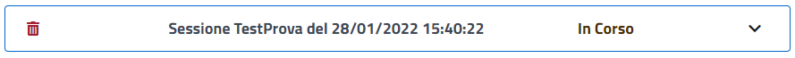
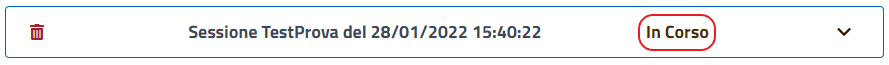
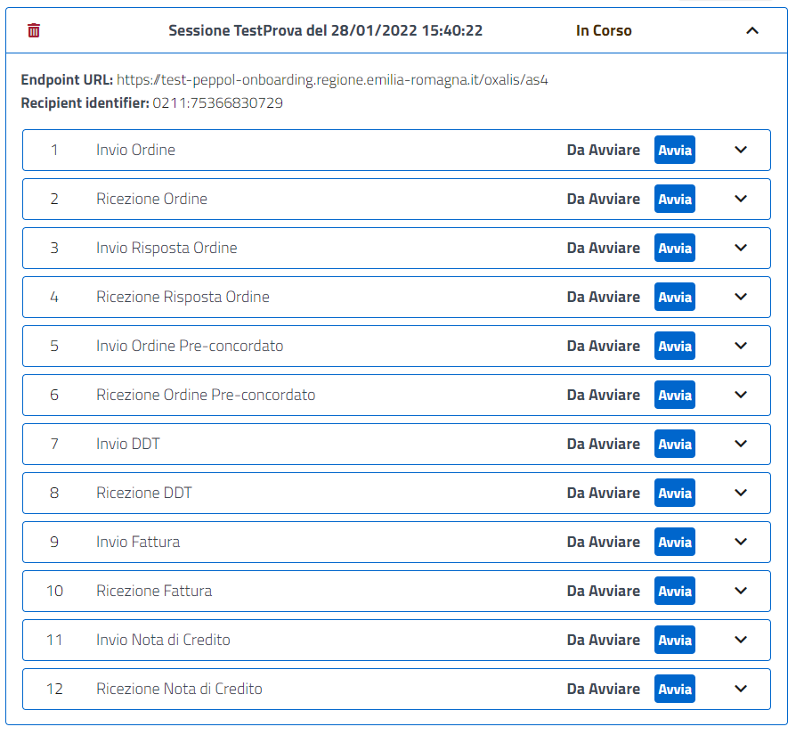
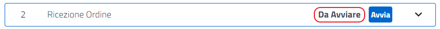
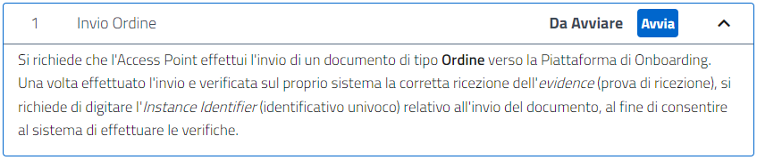

Una volta compilati i dati e premuto il bottone "Crea" la finestra modale sparisce e all'interno della Home Page notiamo che è stata creata la sessione di test.

.Sessione di testce

È possibile cancellare la sessione creata tramite l' icona "Elimina".

.Eliminazione sessione di test

Lo stato della sessione viene sempre riportato in grafica.

.Stato della sessione

Possiamo espandere o ridurre la sessione attraverso l’utilizzo dell’icona di "espansione/riduzione" così da visualizzare l’elenco dei test che la compongono.

.Espansione della sessione
image::../CATTURE/Sessione_di_test-4a225.png[align=center]

Una volta espanso è possibile interagire con i test case precedentemente selezionati nella fase di creazione.

.Sessione di test completa

Per ogni caso di test viene indicata la tipologia:

.Tipologia del test

e lo stato del test:

.Stato del test

Possiamo avviare il test tramite la pressione del tasto "Avvia".

.Avvio del test

Possiamo espandere o ridurre il caso di test attraverso l'utilizzo dell'icona di "espansione/riduzione"

.Espansione del test

Una volta espanso il caso di test viene visualizzata la descrizione del test.

.Descrizione del test

