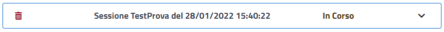
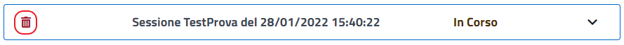
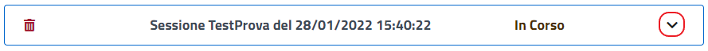
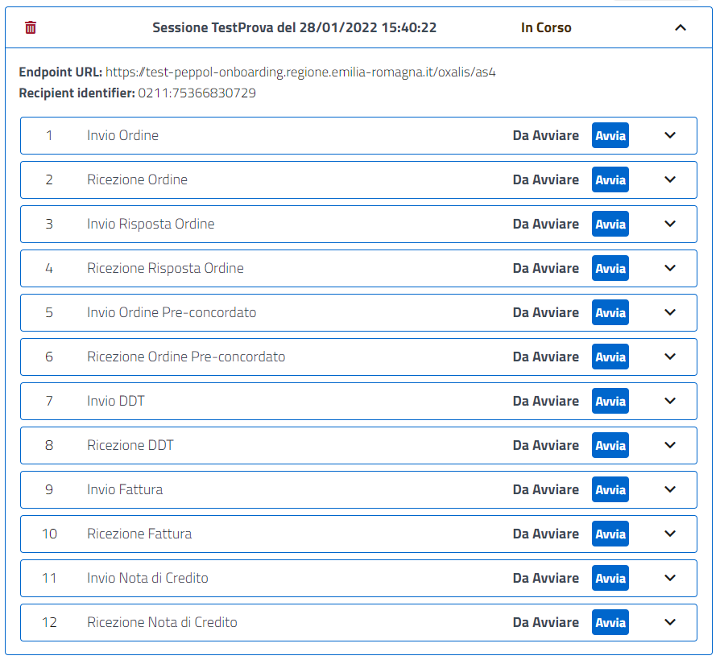
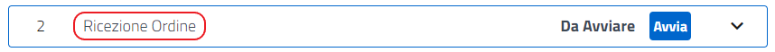
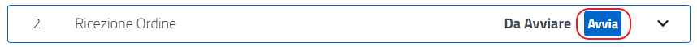
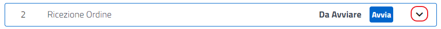

Una volta compilati i dati e premuto il bottone "Crea" la finestra modale sparisce e all'interno della Home Page notiamo che è stata creata la sessione di test.

[.text-center]
_fig.n:_

È possibile cancellare la sessione creata tramite l' icona "Elimina".

[.text-center]
_fig.n:_

Lo stato della sessione viene sempre riportato in grafica.

[.text-center]
_fig.n:_

Possiamo espandere o ridurre la sessione attraverso l'utilizzo dell'icona di "espansione/riduzione"

[.text-center]
_fig.n:_

Una volta espanso è possibile interagire con i test case precedentemente selezionati nella fase di creazione.

[.text-center]
_fig.n:_

All'interno del caso di test vengono indicati la tipologia:

[.text-center]
_fig.n:_

e lo stato del test:

[.text-center]
_fig.n:_

Possiamo avviare il test tramite la pressione del tasto "Avvia".

[.text-center]
_fig.n:_

Possiamo espandere o ridurre il caso di test attraverso l'utilizzo dell'icona di "espansione/riduzione"

[.text-center]
_fig.n:_
