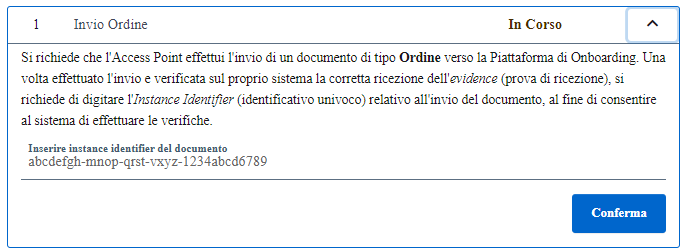

Possiamo premere il tasto "Avvia" per notificare al sistema di iniziare il test di invio documento.

.Avvio del test

Una volta avviato il test, apparirà la casella adibita all’inserimento dell’instance identifier del documento inviato al sistema.

.Inserimento Instance Identifier

Nel caso l’instance identifier inserito sia corretto, la Piattaforma conclude il test con successo.

.Superamento del test

Nel caso l'instance identifier fosse errato lo stato del caso di test verrà aggiornato a fallito e lo stato della sessione di test, di conseguenza, verrà aggiornato a fallito.

.Fallimento del test

