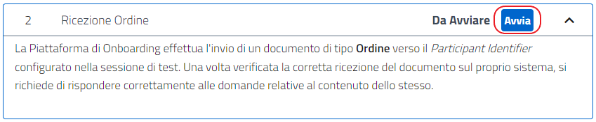
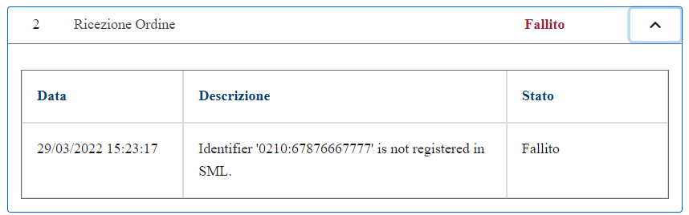
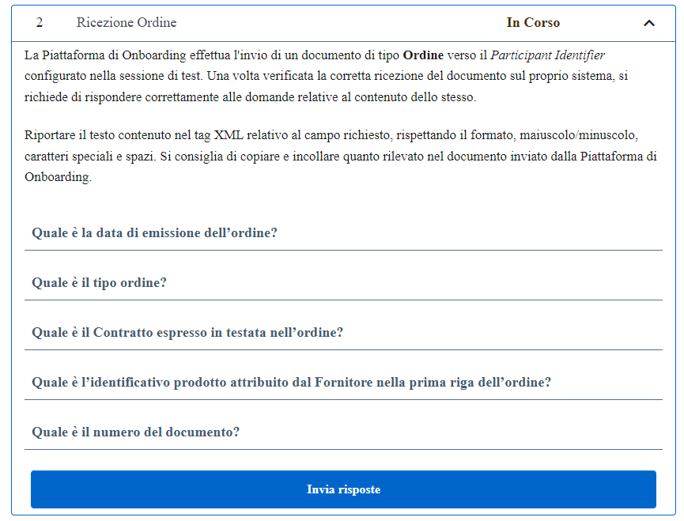
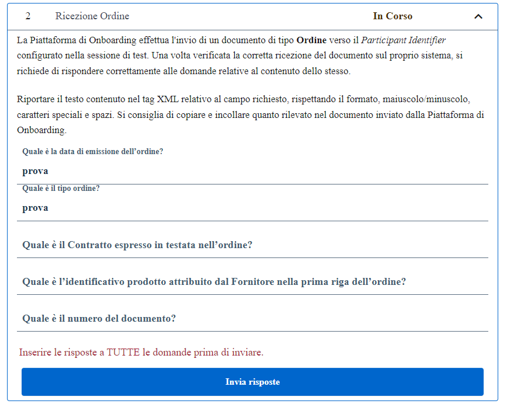
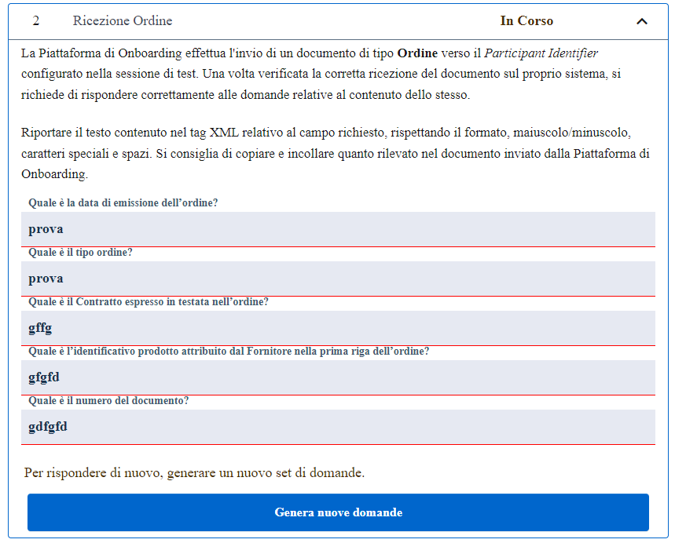
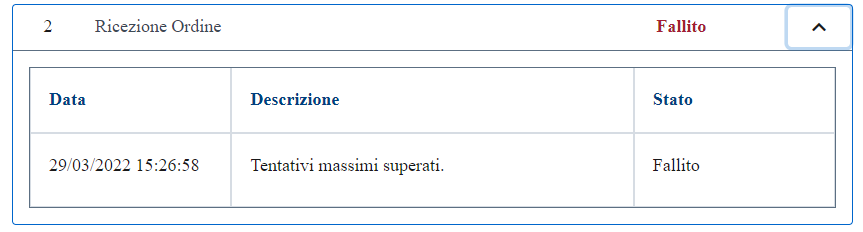
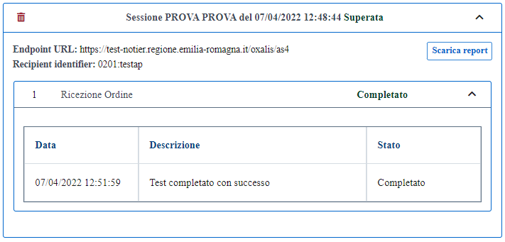

All’avvio del test, la Piattafoma di Onboarding si occuperà della creazione di un documento della tipologia richiesta dal test e dell’invio dello stesso all’Access Point indicato dal Service Provider in fase di creazione della sessione di test. +
A seguito della ricezione del documento, l’Access Point del Service Provider dovrà inviare alla Piattaforma di Onboarding il MDN.

.Avvio del test di ricezione

In caso di mancato ricevimento del documento da parte dell'Access Point del Service Provider, lo stato del caso di test verrà aggiornato a fallito e lo stato della sessione di test di conseguenza verrà aggiornato a fallito. +
Il sistema indica la ragione del fallimento del test.

.Fallimento del test a causa di errore nella ricezione del documento

Nel caso in cui il MDN verrà ricevuto, la Piattaforma di Onboarding mostrerà all'utente Service Provider 5 quesiti random sul documento ricevuto.

.Esempio di quesiti per la verifica della ricezione

Per completare il test è necessario rispondere alle 5 domande presentate, inserendo le informazioni contenute all'interno del documento ricevuto, e premere il tasto "Invia Risposte". +
Al fine di rispondere correttamente, è necessario rispettare gli stessi spazi e l'uso di eventali maiuscole presenti nei campi del documento ricevuto.

.Tasto Invia Risposte

Non è prevista la possibilità di lasciare una o più risposte vuote, è obbligatorio rispondere a tutte le domande presentate. In caso di mancata risposta a tutti i quesiti, il sistema notificherà questa occorrenza con il seguente messaggio:

.Warning sul non completamento delle risposte

Nel caso una o più risposte fossero errate, a seguito della pressione del tasto "Invia Risposte" queste verranno sottolineate in rosso. +
A questo punto è possibile generare un nuovo set di 5 domande (diverse dalle precedenti) e riprovare l'inserimento delle risposte corrette, utilizzando le informazioni del medesimo documento ricevuto all’avvio del test. È possibile riprovare l'inserimento delle risposte per un massimo di 3 volte.

.Set di risposte fallito, generazione di nuove domande

Al fallimento del 3 tentativo, lo stato del caso di test verrà aggiornato a *fallito* e anche lo stato della sessione di test di conseguenza verrà aggiornato a *fallito*.

.Fallimento del test di ricezione

Il test viene considerato superato solo quando viene risposto correttamente a tutte e 5 le domande presentate dal sistema.

.Superamento del test di ricezione

