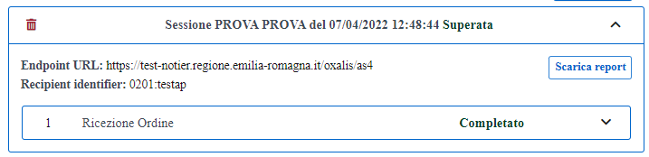
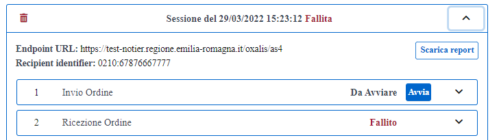

Superati tutti i test previsti dalla sessione di test, nella home page della piattaforma, nella sezione relativa al dettaglio, verrà specificato che la sessione di test è stata completata (indicando la data e l’ora di completamento) e verranno abilitati i bottoni:

•	“Invio test report”: per inviare in automatico l’esito della sessione di test alla Peppol Authority;

.Invio del report alla Peppol Authority
image::../CATTURE/certificati-be485.png[align=center]

•	"Scarica report": per effettuare il download del report in formato .pdf relativo alla sessione di test eseguita.

.Download del report della sessione superata

Cliccando sul bottone “Invio test report”, verrà inviato automaticamente il documento contenete l’esito dei test della sessione di test eseguita alla Peppol Authority.

In caso di fallimento della sessione di test, nella home page della piattaforma, nella sezione relativa al dettaglio,
verrà specificato che la sessione di test è stata fallita (indicando la data e l’ora di fallimento) e verrà abilitato il solo bottone "Scarica report", che consente di effettuare il download del report in formato .pdf relativo alla sessione di test eseguita.

.Download del report della sessione fallita

