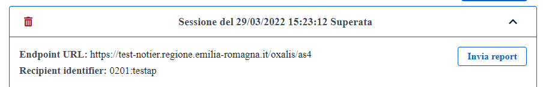

Superati tutti i test previsti dalla sessione di test, nella home page della piattaforma, nella sezione relativa al dettaglio, verrà specificato che la sessione di test è stata completata (indicando la data e l’ora di completamento) e verranno abilitati i bottoni:

•	"Invia report" che consente di inviare automaticamente il documento contenente l'esito dei test della sessione di test eseguita alla Peppol Authority.

.Invio del report alla Peppol Authority

•	 "Scarica report" che consente di effettuare il download del documento in formato .pdf contenente l'esito dei test della sessione di test eseguita.

.Download del report della sessione superata

In caso di fallimento della sessione di test, nella home page della piattaforma, nella sezione relativa al dettaglio,
verrà specificato che la sessione di test è stata fallita (indicando la data e l’ora di fallimento) e verrà abilitato il solo bottone "Scarica report", che consente di effettuare il download del documento in formato .pdf contenente l'esito dei test della sessione di test eseguita. +
Per i casi di test falliti, il report fornisce il dettaglio degli errori rilevati in fase di esecuzione del caso di test.

.Download del report della sessione fallita

