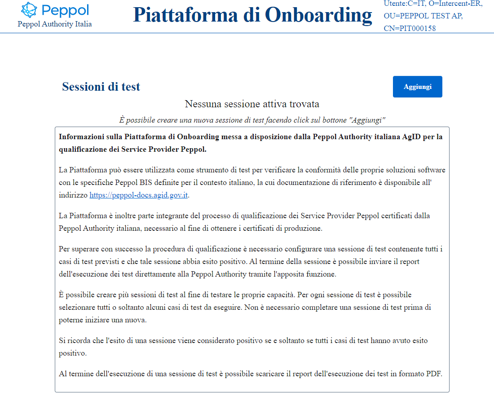
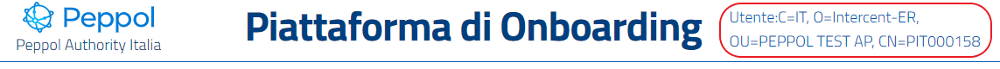
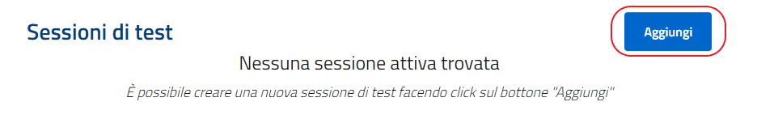

A seguito della validazione del certificato associato all’utente, sarà visualizzata l’home page del sistema, nel caso fosse la prima volta che si accede alla piattaforma non sarà presente nessuna sessione di test.

.Home Page

In alto a destra vengono riportati i dati relativi all'utente che vuole effettuare i test.

.Verifica dell'autenticazione dalla Home

Per creare una nuova sesione di test è necessario cliccare sul bottone "Aggiungi".

.Creazione di una nuova sessione di test

