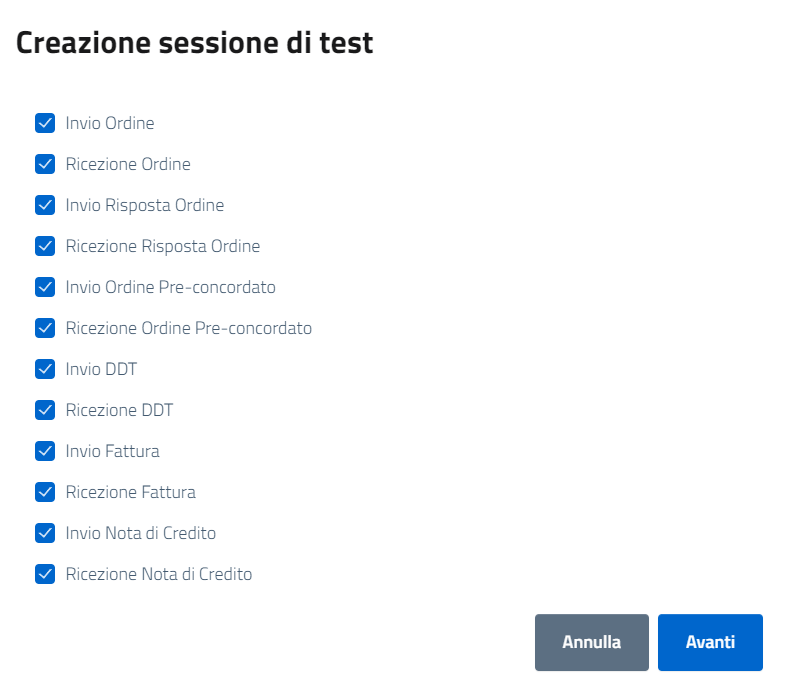
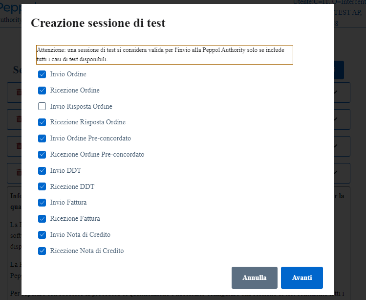

Una volta cliccato il bottone per aggiungere una nuova sessione di test, si aprirà una finestra modale che permette di scegliere i test da effettuare all’interno di quella specifica sessione di test. +
I test sono tutti già selezionati di default, nel caso si voglia effettuare solo alcuni dei test è possibile deselezionare i test non richiesti dalla checkbox.

Si ricorda che per certificare il completamento della procedura di accreditamento da parte della Peppol Authority, è necessario che il Service Provider superi con successo una sessione di test completa di tutti i casi di test previsti dal processo di accreditamento definito da AgID.

.Selezione dei casi di test

Il Service provider può creare una sessione di test in cui non siano presenti tutti i test previsti nella checkbox deselezionando specifici casi. +
In caso di deselezione di anche un solo caso di test, il sistema restituisce il seguente avviso.

.Disclaimer in caso di sessioni di test con casi di test deselezionati

Per annullare la creazione di una nuova sessione di test è necessario cliccare il bottone "Annulla".

.Annullare la creazione di una nuova sessione

Per proseguire nella creazione di una nuova sessione di test è necessario cliccare il bottone "Avanti".

.Proseguire nella creazione di una sessione

