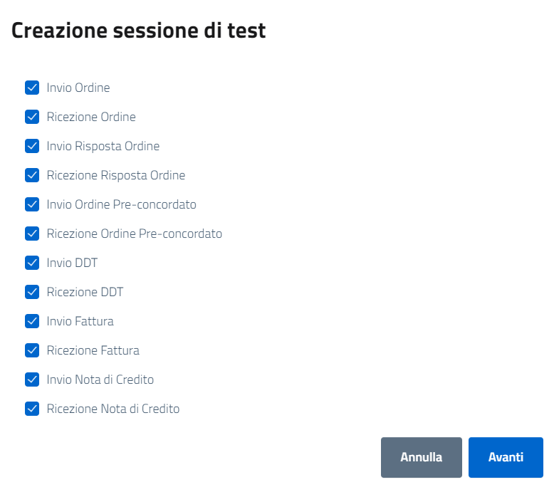
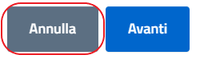
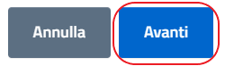

Una volta cliccato il bottone per aggiungere una nuova sessione di test, si aprirà una finestra modale che permette di scegliere i test da effettuare all'interno di quella specifica sessione di test.

[.text-center]
_fig.n:_

I test sono tutti già selezionati di default, nel caso si voglia effettuare solo alcuni dei test è necessario deselezionare le checkbox.

Per annullare la creazione di una nuova sessione di test è necessario cliccare il bottone "Annulla".

[.text-center]
_fig.n:_

Per proseguire nella creazione di una nuova sessione di test è necessario cliccare il bottone "Avanti".

[.text-center]
_fig.n:_

Si ricorda che per effettuare la certificazione *tutti* i test devono essere completati con successo.
