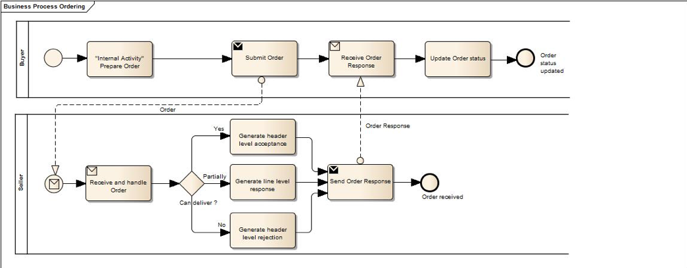

[[process-and-typical-use-cases]]
= Process and typical use cases

The Ordering process includes the sending of Orders from a Buyer to a Seller and the response of the Seller.

[[process-flow]]
== Process flow

The Ordering process flow can be described as follows:

* A Buyer submits an Order to the Seller requesting for delivery of goods or services
* An Order may refer to a framework agreement for its terms and conditions; otherwise the Buyer’s terms and conditions apply.
* An Order may contain items (goods or services) with item identifiers or items with free text description.
* The Seller may acknowledge that the order is received.
* The Seller may accept the Order, committing himself to the conditions stated therein by means of an Order Response transaction.
* Alternatively, the Seller may reject the Order by means of the Order Response transaction.
* An order rejection may contain reasons for rejection.
* If contractually agreed, the Seller also may respond to the order, changing details that are acceptable by the Buyer.
** If an order is accepted with change, the buyer and seller need to have an agreement between them regarding the processing of the changed order,
 i.e when is a contract concluded and when can the items be shipped.
* If the order was accepted a contract is concluded.
If the order was rejected, no contract and no residual obligations exist.
* After the receipt of an Order Response that rejects the order, the Buyer may start a new ordering process, taking into account the reasons for the rejection by the Seller.

[[Requisiti-dei-processi-di-business]]
== #Business processes requirements#

As a result of the reception of an order, the Seller that must contain the indication of the Order previously sent, by which intends to communicate, alternatively, the following: +

* the Order has been received (Response of receipt);
* the Order is accepted without amendment (Response of acceptance);
* the Order is rejected (Response of denial);
* the Order is accepted with amendment (Response with changes).

The Response with changes must contain all the Order lines, both those that are to be modified and maintained, since it is intended to supplement the related Order previously sent. +

The Response to a revoked Order has no effect for the Buyer.

:leveloffset: +1

include::../../../shared/bpmn/_bpmn-legend.adoc[]

:leveloffset: -1

The following diagram shows the choreography of the business process implemented by the BIS.

:leveloffset: +1

include::_use-case1.adoc[]

include::_use-case2.adoc[]

include::_use-case3.adoc[]

include::_use-case4.adoc[]

:leveloffset: -1
