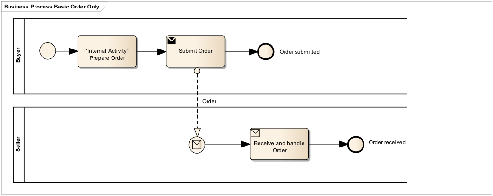

[[process-and-typical-use-cases]]
= Process and typical use cases

The Order only profile includes the sending of Orders from a Buyer to a Seller.

[[process-flow]]
== Process flow

The Order process flow can be described as follows:

* A Buyer submits an Order to the Seller requesting for delivery of goods or services
* An Order may refer to a framework agreement for its terms and conditions; otherwise the Buyer’s terms and conditions apply.
* An Order may contain items (goods or services) with item identifiers or items with free text description.

[[Requisiti-dei-processi-di-business]]
== #Requisiti dei processi di business#

Salvo che non sia previsto diversamente da norme, usi commerciali o accordi tra le parti,
il Fornitore non è tenuto a trasmettere la Risposta, pertanto l’assenza di Risposta equivale ad accettazione dell’Ordine.  +

In caso di utilizzo della risposta, si veda il profilo Ordinazione Completa. +

:leveloffset: +1

include::../../../shared/bpmn/bpmn-legend.adoc[]

:leveloffset: -1

The following diagram shows the choreography of the business process implemented by the BIS.

:leveloffset: +1

include::_use-case1.adoc[]

include::_use-case2.adoc[]

include::_use-case3.adoc[]

include::_use-case4.adoc[]

:leveloffset: -1
