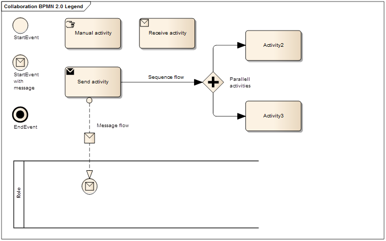

[[process-and-typical-scenarios]]
= Process and typical scenarios

[[legend-for-bpmn-diagrams]]
== Legend for BPMN diagrams

The diagrams are expressed in the BPMN notation.
The diagram below serves as an explanation for the diagrams used in the process descriptions.

The following section and diagrams show the choreography of the business process involving various parties.

:leveloffset: +1

include::_simpleprocess.adoc[]

include::_advancedprocess.adoc[]

:leveloffset: -1

[[typical-use-cases]]
== Typical use cases

:leveloffset: +1

include::_usecase1.adoc[]

include::_usecase2.adoc[]

include::_usecase3.adoc[]

include::_usecase4.adoc[]

include::_usecase5.adoc[]

:leveloffset: -1
