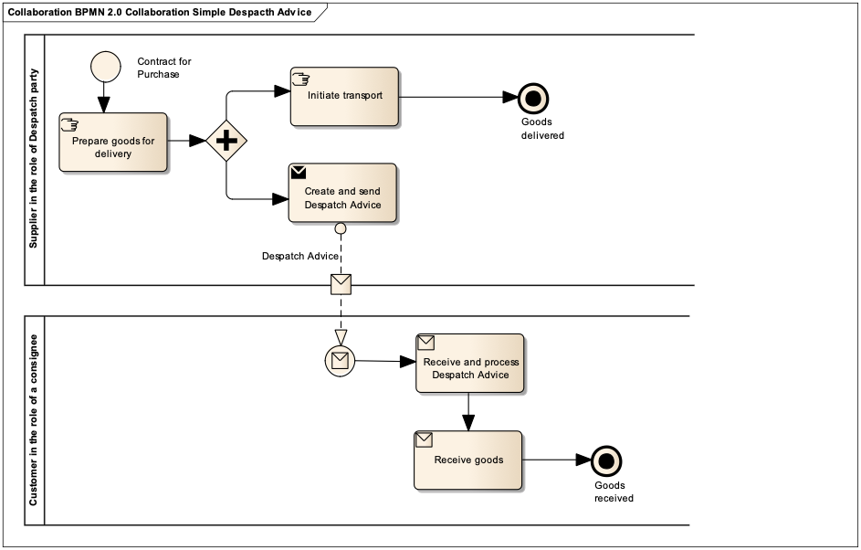
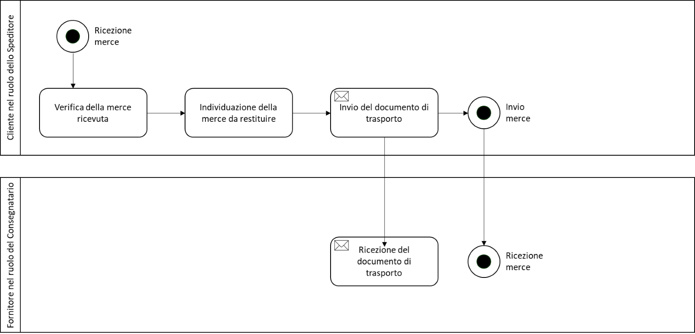

[[simple-process-two-parties-involved]]
= Simple process – two parties involved

Following the establishment of a contract for purchase the Supplier, in the role of Despatch party, delivers or provides the contracted goods or services to the customer, who has the role of a consignee.

== Process of return of goods

In the Italian context it is allowed to use the Despatch Advice Peppol by the Customer, in the role of the Sender, who returns the goods received from the Supplier, in the role of Consignee. +

This scenario is managed through a Despatch Advice characterized by the delivery type 729 - Return Document. +

The scenario is available only between subjects operating in the Italian domain. Therefore it is necessary to verify that the Supplier is also authorized to receive Despatch Advice. +

It is appropriate to indicate the reference to the previous Despatch Advice with which the returned goods were delivered within the structure cac:AdditionalDocumentReference, concatenating the document number and date through the character "#". 

.Example of process of return of goods (Returns Advice) 
[source, xml, indent=0]
----
<cac: AdditionalDocumentReference> 
 <cbc:ID>1234#2025-05-22<cbc:ID> 
 <cbc:DocumentType>Documento di Reso<cbc:DocumentType>
<cac: AdditionalDocumentReference> 
----