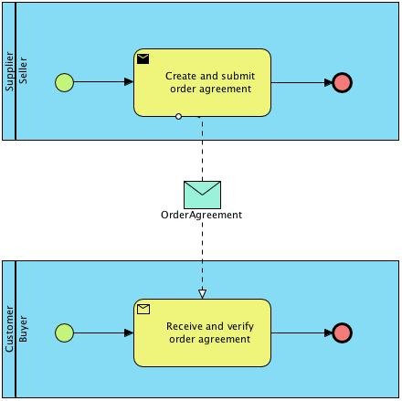

[[process-and-typical-use-cases]]
= Process and typical use cases

The order agreement BIS includes the sending of information on agreed products/services from a Seller to a Buyer.

== Process flow

The order agreement process flow can be described as follows:

.Possible start positions:
. A Buyer makes a purchase of goods or services from the Seller.
. A Seller reports one or more accumulated purchases made under a framework agreement to the Buyer.

.End positions:
. A purchase has been recorded in the Buyer´s purchasing system. The seller proceeds to invoice accordingly.

An Order Agreement may refer to a framework agreement for its terms and conditions; otherwise the Buyer’s terms and conditions apply.

[[Requisiti-dei-processi-di-business]]
== #Business processes requirements#

This process involves the use of two Documents: +

* an *Order agreement*, issued by the Seller;
* a *Confirmation Order*, eventually issued by the Client.

The process starts with the sending of an order agreement from the Seller, who issue it because he is pre-authorized by the Client. +

Following the reception of the Order Agreement, the Client can: +

* conclude the process without issuing a Confirmation Order; +

* transmit a Confirmation Order, that needs to contain the indication of the Order Agreement to which it is related to, for communicating to the Seller that he intends to: +

** confirm the Order Agreement received (Ordine di riscontro per conferma); +

** reject the Order Agreement received (Ordine di riscontro per
diniego);

** replace the Order Agreement received (Ordine di riscontro sostitutivo).

:leveloffset: +1

include::../../../shared/bpmn/_bpmn-legend.adoc[]

:leveloffset: -1

The following diagram shows the choreography of the business process implemented by the BIS.

[cols=",",]
|====
|*Categories* |*Description and Values*
|Description a|
The buyer doesn’t use the purchasing system to create an order. It’s done outside of this system.

The seller creates an order in his ordering system based on requirements from the buyer and, after agreeing/committing to it, sends a copy of the order as an Order agreement to the buyer.

|Pre-conditions a|
The seller’s ordering system must be able to send Order agreement transactions.

The buyer’s purchasing system must be able to receive Order agreement transactions.

The content of the order is agreed through use of web shop, phone, email, physical visit to shop or other means.

|Post-conditions |The buyer has received an order agreement that is recorded in the purchasing system.
|Legal Implications |By providing an Order agreement transaction the Seller commits himself the, quantities, prices and terms stated in the Order agreement transaction.
|====

:leveloffset: +1

include::_use-case1.adoc[]

include::_use-case2.adoc[]

include::_use-case3.adoc[]

include::_use-case4.adoc[]

include::_use-case5.adoc[]

:leveloffset: -1
