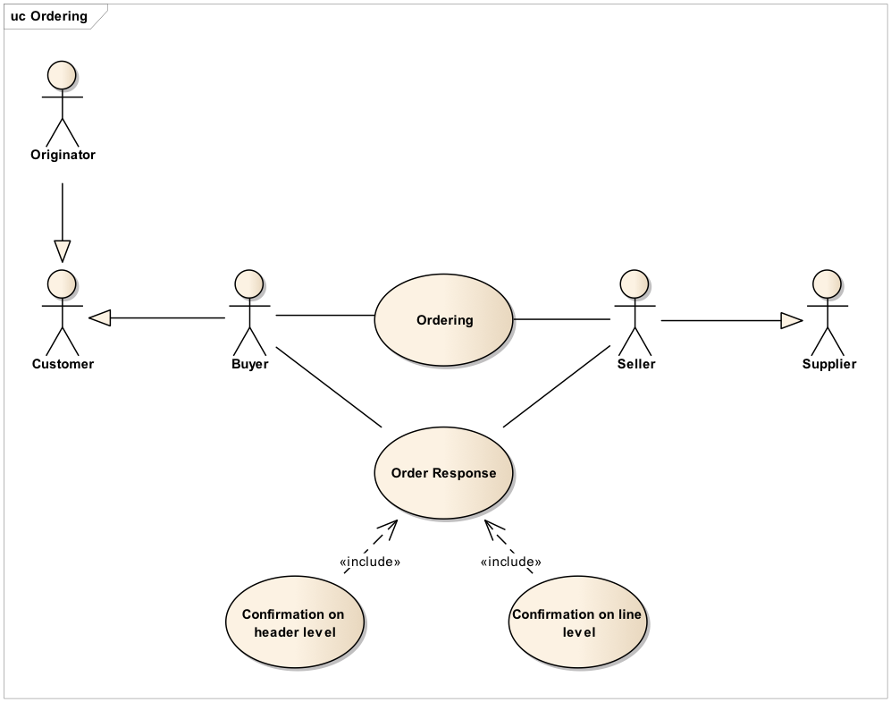

[[parti-e-ruoli]]
= Parti e ruoli

La tabella seguente fornisce le definizioni delle parti e dei ruoli nel processo dell’ordine di fornitura.

[cols="2,5", options="header"]
|====
s|Parti di business
s|Descrizione

|*Cliente*
|Il Cliente è la persona giuridica o l'organizzazione che richiede beni e/o servizi. 

Esempi di ruoli per il cliente: Acquirente, Richiedente, Intestatario fattura e Consegnatario/Destinatario.

|*Fornitore*
|Il Fornitore è la persona giuridica o l'organizzazione che fornisce beni e/o servizi. Il Fornitore ricopre il ruolo di Venditore.

|====

[cols="2,5", options="header"]
|====
s|Ruolo/attore
s|Descrizione

|*Acquirente* +

`cac:BuyerCustomerParty` +

|L’Acquirente è la persona giuridica o l’organizzazione che acquista beni e/o servizi.

|*Venditore* +

`cac:SellerSupplierParty` +

|Il Venditore è la persona giuridica o l’organizzazione che vende beni e/o servizi.

|*Richiedente* +

`cac:OriginatorCustomerParty` +

|Il Richiedente è la persona giuridica o l’organizzazione che inizializza il processo di emissione dell'Ordine e per la quale l'Acquirente effettua l'acquisto.

|*Intestatario fattura* +

`cac:AccountingCustomerParty` +

|L’intestatario fattura è la persona giuridica o l’organizzazione a cui deve essere intestata la fattura relativa all'ordine.

|*Consegnatario/Destinatario* +

`cac:Delivery/cac:DeliveryParty` +

|Il Consegnatario/Destinatario è la persona giuridica o l’organizzazione che riceve i beni e/o i servizi oggetto dell’ordine.

|====

Il diagramma seguente mostra i ruoli nel processo di evasione dell’ordine con risposta.

