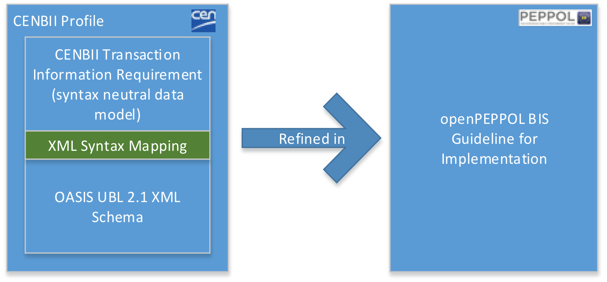

[[introduction-to-openpeppol-and-bis]]

= Link al Portale Specifiche

https://peppol-docs.agid.gov.it/docs/[Vai al Portale Specifiche]

= Introduzione a openPeppol e alla BIS

Questa Business Interoperability Specification (BIS) è il risultato del lavoro svolto in https://peppol.eu/about-openpeppol/?rel=tab41[OpenPeppol] e pubblicato come parte delle specifiche https://docs.peppol.eu/poacc/upgrade-3/[Peppol].

Questo Peppol BIS fornisce un set di specifiche per implementare un processo di business PEPPOL.
Il documento è inteso per chiarire i requisiti necessari per assicurare l’interoperabilità nell’eProcurement Pubblico pan-europeo e fornisce le linee guida per il supporto e l’implementazione di questi requisiti. +

La Peppol BIS è basata sul profilo *CEN WS/BII2 “Profile BII30 Dispatch Only”*, il quale è stato esteso in base ai requisiti del modello italiano di e-Procurement. +

Fare riferimento alla sezione "8.2 Identificatori per la customizzazione e profilo" per ulteriori informazioni.

#In questo documento le regole d'uso ed i paragrafi derivanti dal modello italiano di e-Procurement sono evidenziate in giallo.#

.Relazioni fra i profili BII e il Peppol BIS

[[background-and-objective]]
== Contesto e obiettivi

Il Peppol BIS (Business Interoperability Specification) fornisce le specifiche per implementare i documenti di business PEPPOL.
Le specifiche abilitano qualsiasi azienda a emettere documenti elettronici che soddisfano i requisiti di processo legali e di business nell’Unione Europea e la EEA.
Supporta un sottoinsieme delle informazioni utilizzate dalla maggior parte dei settori industriali e abilita gli utenti a emettere documenti (fatture, ordini, avvisi di spedizione, ecc.) che sono validi per il commercio transfrontaliero all’interno dell’Unione Europea e la EEA.

Lo *scopo* di questo documento è di descrivere un formato comune per il messaggio del Documento di Trasporto nel mercato europo, e di facilitare l’implementazione efficiente e l’uso crescente della collaborazione elettronica relativa al processo di evasione dell’ordine basato su questo formato.

:leveloffset: +1

include::../../../shared/files/_audience.adoc[]

:leveloffset: -1
