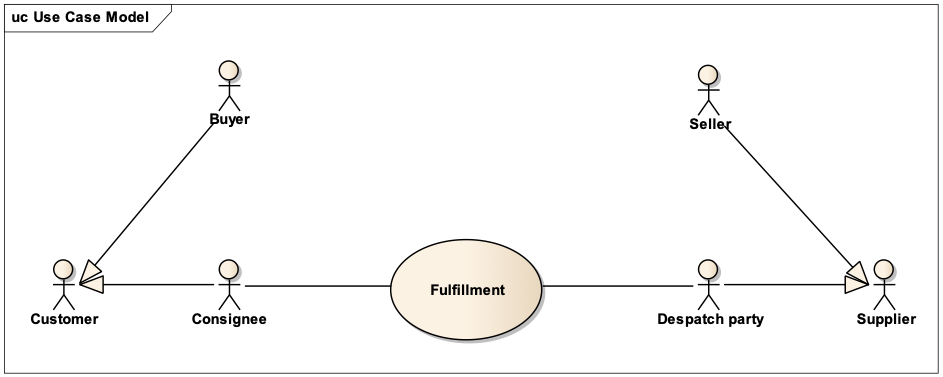

[[parties-and-roles]]
= Parti e ruoli

La tabella seguente fornisce la definizione delle parti e dei ruoli nel processo di evasione dell’ordine (fulfilment).

[cols="2,5",options="header",]
|====
|Parti di business |Descrizione
|*Cliente* |Il Cliente è la persona giuridica o l'organizzazione che richiede beni e/o servizi. 

Esempi di ruoli per il cliente: Acquirente, Richiedente e Consegnatario/Destinatario.

|*Fornitore* |Il Fornitore è la persona giuridica o l'organizzazione che fornisce beni e/o servizi. Il Fornitore ricopre il ruolo di Venditore.

|*Vettore* |Il Vettore è la persona giuridica o l'organizzazione che gestisce la consegna/trasporto fisico della spedizione. Utilizzato se il trasporto è effettuato da una terza parte.
|====

[cols="2,5",options="header",]
|====
|Ruolo/Attore |Descrizione
a|
*Speditore/Mittente*

`cac:DespatchSupplierParty`

 |Lo Speditore/Mittente è la persona giuridica o l’organizzazione che spedisce la merce e/o eroga i servizi.

a|
*Consegnatario/Destinatario*

`cac:DeliveryCustomerParty`

 |Il Consegnatario/Destinatario è la persona giuridica o l’organizzazione che riceve beni e/o servizi oggetto dell’ordine.

a|
*Acquirente*

`cac:BuyerCustomerParty`

 |L’Acquirente è la persona giuridica o l’organizzazione che acquista beni e/o servizi e corrisponde al Cessionario/Committente della fattura ai sensi del DPR n. 633/1972.
a|
*Venditore*

`cac:SellerSupplierParty`

 |Il Venditore è la persona giuridica o l’organizzazione che vende beni e/o servizi e corrisponde al Cedente/Prestatore della fattura ai sensi del DPR n. 633/1972.
a|
*Richiedente*

`cac:OriginatorCustomerParty`

 |Il Richiedente è la persona giuridica o l’organizzazione che inizializza il processo di emissione dell'Ordine e per la quale l'Acquirente effettua l'acquisto.
a|
*Vettore*

`cac:CarrierParty`

 |Il Vettore è la persona giuridica o l'organizzazione che gestisce la consegna/trasporto fisico della spedizione. Utilizzato se il trasporto è effettuato da una terza parte.
|====

Il diagramma seguente mostra i ruoli nel processo di evasione dell’ordine.

