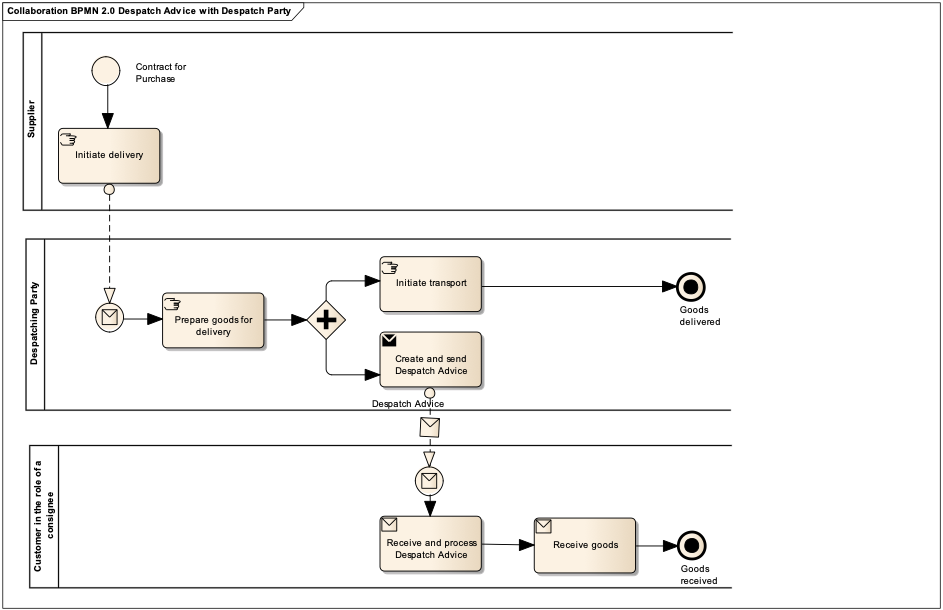

[[more-advanced-process-use-of-despatch-party]]
= Processo più avanzato – uso del Trasportatore

Il processo più avanzato si basa su quello più semplice descritto precedentemente con l’aggiunta del Trasportatore che è responsabile per la preparazione fisica della merce per la consegna.
Questa situazione avviene tipicamente quando il fornitore ha dato in outsourcing la funzione logistica ad un’altra azienda.

