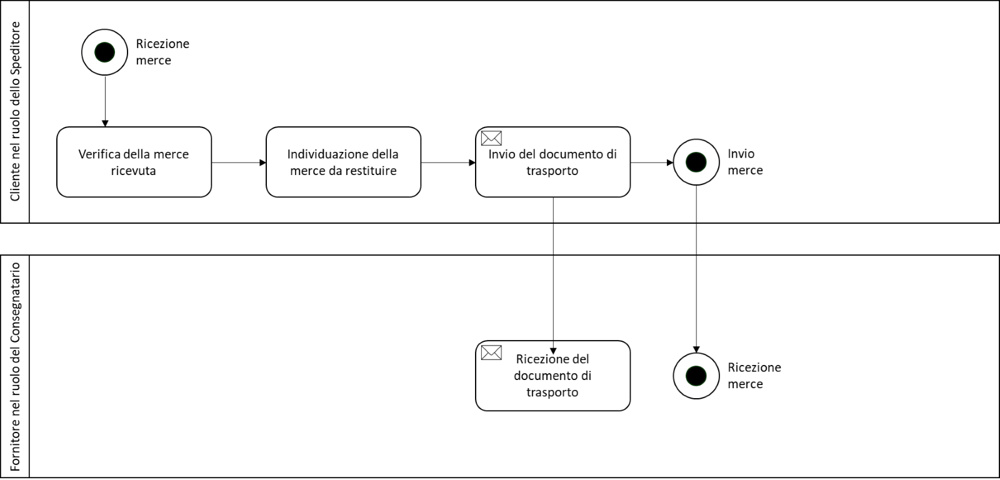

[[simple-process-two-parties-involved]]
= Processo semplice – due parti coinvolte

In seguito alla stipula di un contratto di acquisto il Fornitore, nel ruolo dello Speditore, consegna o fornisce la merce ordinata o i servizi al Cliente, che ha il ruolo del Consegnatario.

image:../images/bpmn-simple.png[image,width=662,height=422]

== #Processo di reso della merce#

Nel contesto italiano è consentito l’utilizzo del DDT Peppol da parte del Cliente, nel ruolo dello Speditore, che restituisce la merce ricevuta dal Fornitore, nel ruolo di Consegnatario. +

Tale scenario è gestito attraverso un DDT caratterizzato dalla tipologia di consegna 729 – Documento di Reso. +

Lo scenario è disponibile unicamente tra soggetti operanti nel dominio italiano. Pertanto è necessario verificare che il Fornitore sia abilitato anche alla ricezione dei DDT. +

È opportuno indicare il riferimento al DDT precedente con cui è stata consegnata la merce oggetto del reso all’interno della struttura cac:AdditionalDocumentReference, concatenando il numero del documento e la data attraverso il carattere “#”. + 

.Esempio di processo di reso della merce (Documento di Reso) 
[source, xml, indent=0]
----
<cac:AdditionalDocumentReference> 
 <cbc:ID>1234#2025-05-22<cbc:ID> 
 <cbc:DocumentType>Documento di Reso<cbc:DocumentType>
<cac:AdditionalDocumentReference> 
----