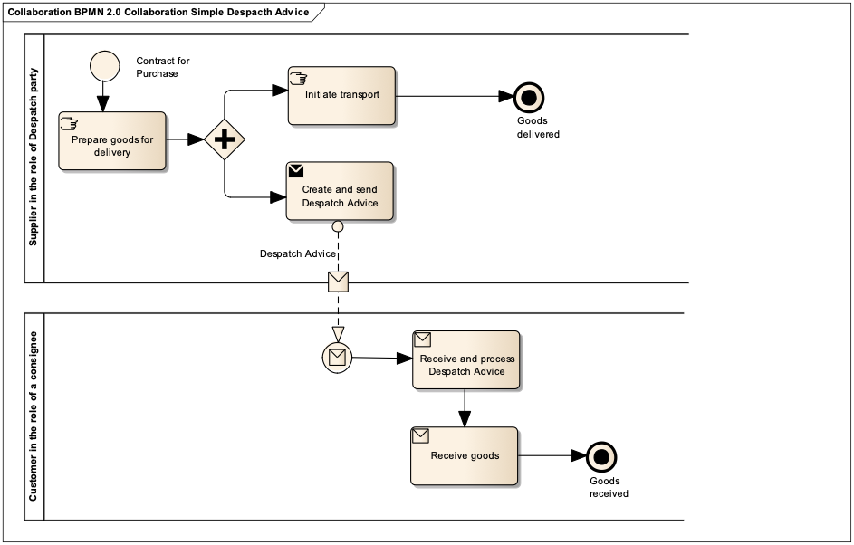

[[simple-process-two-parties-involved]]
= Processo semplice – due parti coinvolte

In seguito alla stipula di un contratto di acquisto il Fornitore, nel ruolo dello Speditore, consegna o fornisce la merce ordinata o i servizi al Cliente, che ha il ruolo del Consegnatario.

