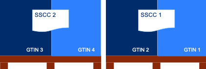
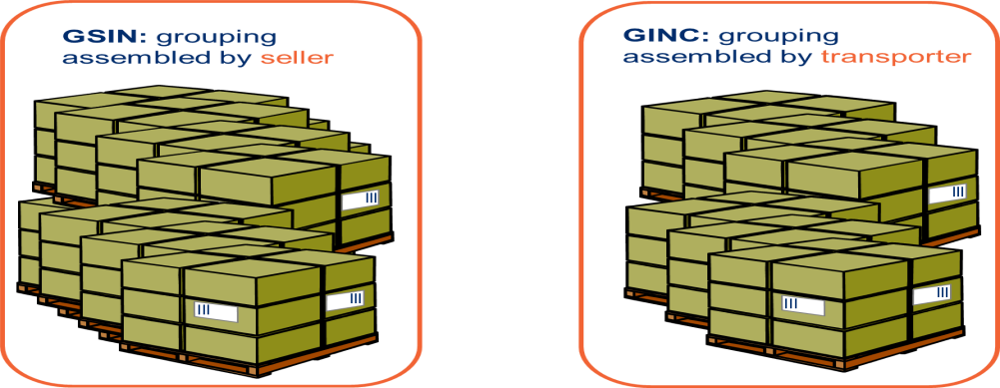

[[use-case-3---despatch-with-logistic-units-using-gs1-keys]]
== Caso d’uso 3 – Spedizione con unità logistica utilizzando le chiavi GS1

Questo caso d’uso rappresenta l’uso più specifico del Documento di Trasporto (DDT) dove vengono applicate al suo interno diverse chiavi GS1 per identificare diverse entità nel documento, come; Parti di business, Endpoint, Shipment id, consignment id, logistic unit id ed identificatori dei prodotti.

[cols="1,5",options="header",]
|====
|*Nr. Caso d’uso* |3
|*Nome Caso d’uso* |Documento di Trasporto con unità logistica e uso di chiavi GS1
|*Descrizione Caso d’uso* a|
Descrive un processo completo per cui uno Speditore genera un Documento di Trasporto basato su informazioni relative all’ordine e ai prodotti.
Il Documento di Trasporto (DDT) abilita il Fornitore / Trasportatore a fornire informazioni dettagliati sul contenuto di una spedizione e permette all’Acquirente di riconciliare, o confermare, la spedizione fisica a fronte dell’ordine; esso fornisce una copia del dettaglio di imballaggio della spedizione e la composizione della consegna.
Il Documento di Trasporto è inviato dallo Speditore al Consegnatario quando la merce viene inviata. 

|*Parti coinvolte* a|
* Speditore (In UBL: DespatchSupplierParty) (In questo caso è soggetto giuridico diverso dal Venditore)
* Venditore (In UBL: SellerSupplierParty)
* Consegnatario (In UBL: DeliveryCustomerParty) (In questo caso è soggetto giuridico diverso dall’Acquirente)
* Acquirente (In UBL: BuyerCustomerParty) 

|*Pre conditions* |Allineamento delle anagrafiche centrali con ubicazioni (GLNs) e prodotti (GTINs).
|*Post conditions* |Il Documento di Trasporto è ricevuto dal destinatario della merce.
|*Assunzioni* a|
[loweralpha]
..  Il DDT ha un ID di spedizione (GSIN) assegnato dal venditore
..  Il DDT ha un ID di consegna che è stato assegnato dal trasportatore (GINC)
..  Un luogo di consegna (no cross-docking) che è identificato da un GLN.
..  Le quattro righe di spedizione sono ciascuna una unità ordinabile – un GTIN.
..  Due unità ordinate (GTIN) sono imballate in ogni pallet.
..  Ci sono due pallet nella spedizione.
..  Ad ogni pallet standard è assegnata un’etichetta logistica (SSCC) identificativa.
..  Un’etichetta logistica è stata applicate ad ognuno dei pallet dove l’SSCC è usato e rappresentato con numeri in chiaro, dettagli sull’indirizzo e codice a barre GS1 128.
+
_Relazione tra il GTIN e le chiavi  SSCC_
+

|*Il flusso* a|
Il Venditore ha accettato l’ordine senza modifiche.

.  Il Venditore preleva la merce ordinata 
.  La merce ordinata consiste di un pallet ogni 2 righe di articoli ordinati.
.  Lo Speditore carica la merce per il trasporto. 
.  Lo Speditore invia il DDT al Consegnatario
.  Il Consegnatario receve il DDT 
.  Il Consegnatario usa il contenuto del DDT per registrare l’accettazione.

|*Risultato* a|
.  Il Documento di Trasporto ha aiutato il Consegnatario a preparare l’accettazione della merce:
..  In tempo
..  Nel luogo corretto (indirizzo)
.  Il Documento di Trasporto ha aiutato il Consegnatario nella registrazione dell’accettazione per identificare:
..  L’ordine
..  Le righe d’ordine
..  Le unità logistiche 
..  La descrizione della merce
..  La quantità evasa
..  Le Parti coinvolte nel processo

|*Esempio XML* |Vedi Allegato A per un esempio di file che illustra il Caso d’uso 3.
|====

Di seguito si forniscono ulteriori dettagli e chiarimenti sulle varie chiavi e identificatori utilizzati in questo Caso d’uso, come pure i benfici che gli implementatori possono ottenere quando li usano. Infine vi sono due immagini che chiariscono la relazione che intercorre tra gli identificatori GSIN e GINC.

[cols="2,4",options="header",]
|====
2+|Sotto, una panoramica e una spiegazione delle chiavi usate nel caso d'uso.
a|

*GLN:*

Global location number |

Speditore - Identificazione organizzativa. +
Speditore - Identificazione Endpoint. +
Consegnatario - Identificazione organizzativa. +
Consegnatario - Identificazione Endpoint. +
Acquirente - Identificazione organizzativa. +
Acquirente - Identificazione Endpoint. +
Venditore - Identificazione organizzativa. +
Venditore - Identificazione Endpoint. +

a|
**SSCC**:

Serial Shipping Container Code

 a|
Ad ogni unità logistica viene assegnata una SSCC. +

L’SSCC è una chiave identificativa GS1 per un articolo di qualsiasi composizione utilizzato per il trasporto e/o deposito che necessita di essere gestito attraverso la catena di fornitura. L’SSCC è assegnato per la durata del trasporto dell’articolo merce ed è un elemento obbligatorio nell’Etichetta Logistica di GS1

a|
*GSIN:*

Global Shipment Identification Number

 a|
Identificativo della Spedizione. Un numero di spedizione per il Documento di Trasporto. +

A livello documento questo specifica il numero assegnato all’intera Spedizione, che può essere formata da diverse consegne. +

* Numero assegnato dal venditore per identificare un raggruppamento logico di unità logistiche o di trasporto che sono tipicamente assemblate dal venditore per il trasporto di una spedizione.
* È allineato al requisito del Unique Consignment Reference (UCR) del World Customs Organisation (WCO). +

È approvato da ISO/IEC 15459 (ISO License Plate).

a|
*GINC:*

Global Identification Number of Consignment

 a|
Un numero di consegna per il Documento di Trasporto +

* Utilizzato per identificare il raggruppamento logico di unità logistiche o di trasporto che sono assemblate per il trasporto associato ad un documento di trasporto.
* È utilizzato per identificare il raggruppamento logico di unità logistiche durante uno specifico viaggio nel quale ci potrebbbero essere molteplici fasi di consegna.

a|
*GTIN:*

Global trade Item Number

 a|
Ogni articolo ordinato come un GTIN. +

Identificazione del Prodotto.

|====

[cols="2,4",options="header",]
|====
2+|Sotto, una panoramica dei benefici che gli implementatori possono ottenere dall’uso di chiavi e identificatori.
|
*GTIN:*

Global trade Item Number

a|
* La merce corretta e i dati associati sono stati ottenuti grazie ad un allineamento dei dati a monte.

|
*GLN*

Global Location Number

a|
* Dati di ubicazione precisi e fidati sono stati ottenuti attraverso l’allineamento con i registri anagrafici principali di GS1.

|
*SSCC:*

Serial Shipping Container Code

a|
* Le unità logistiche vengono identificate individualmente mediante l’SSCC (Serial Shipping Container Code)
* I dettagli sul’articolo merce vengono acceduti attraverso la lettura di codici a barre o leggendo (EPC/RFID) l’SSCC posto sull’unità logistica. 
* L’uso dell’SSCC su di una unità logistica è soggetto a regole, cioè che multiple SSCC visibili su di una unità logistica possono essere solo utilizzate a scopo di transito.
** Se due o più SSCC vengono applicate su di una unità logistica, le unità associate ad una data SSCC devono essere avvolte o legate insieme a formare un’unità logistica individuale.
** Multipli SSCC possono essere applicate su unità individuali di una unità logistica per il successivo cross-docking ma queste DEVONO essere avvolte in modo da non essere visibili.
* Inoltre, un’etichetta logistica principale deve essere applicata all’unità logistica complessiva per la consegna al centro di distribuzione.

a|
**GSIN**:

Global Shipment Identification Number

a|
* Un numero di spedizione riconosciuto a livello globale utilizzato per identificare univocamente la spedizione nel suo complesso come specificato dal venditore.

|
*GINC:*

Global Identification Number of Consignment

a|
* Un numero di consegna riconosciuto a livello globale utilizzato per identificare univocamente la consegna come specificato dallo spedizioniere.

|====

*Chiarimenti supplementary sull’uso del GSIN e del GINC.*

_Assemblaggio delle chiavi:_

