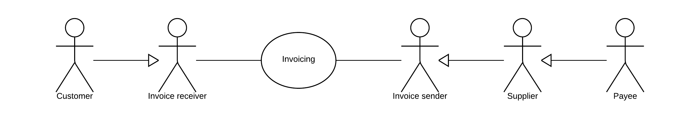

[[roles]]
= Parties and roles

The diagram below shows the roles involved in the invoice and credit note transactions. The customer and invoice receiver is the same entity, as is the supplier and the invoice sender.

== Parties

Customer::
The customer is the legal person or organisation who is in demand of a product or service. Examples of customer roles: buyer, consignee, debtor, contracting authority.

Supplier::
The supplier is the legal person or organisation who provides a product or service.

#Il Beneficiario#::
Il beneficiario è una persona, istituto bancario o entità di business alla quale si effettua il pagamento (es. factoring).

#Rappresentante Fiscale#::
In alcuni scenari di business, le aziende che commerciano oltre confine sono tenute secondo le autorità fiscali locali a nominare un rappresentante fiscale. 
Sono comprese le aziende extra-EU che operano in Europa, gli importatori in EU e i commercianti.  
+
I rappresentanti fiscali sono responsabili per la gestione corretta e la regolarizzazione dell'IVA per conto delle aziende, in linea con le normative locali. Un rappresentante fiscale è considerato come l'agente locale del commerciante.  In molti casi, il rappresentante fiscale è ritenuto responsabile in solido per le tasse del commerciante.

#Soggetto Emittente#::
Un soggetto terzo (intermediario) che emette fattura per conto del cedente / prestatore.

#Vettore#::
Il vettore è la persona giuridica o organizzazione che consegna la merce al destinatario ed è responsabile del suo trasporto.

== Roles

Creditor::
One to whom a debt is owe. The party that claims the payment and is responsible for resolving billing issues and arranging settlement. The party that sends the invoice or credit note. Also known as invoice issuer, accounts receivable or seller.

Debtor::
One who owes debt. The party responsible for making settlement relating to a purchase. The party that receives the invoice or credit note. Also known as invoicee, accounts payable, or buyer.
