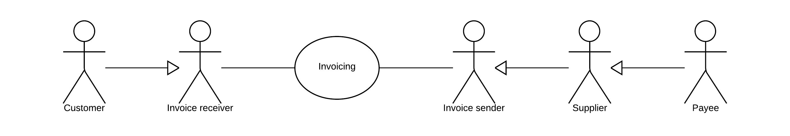

[[roles]]
= Parties and roles

The diagram below shows the roles involved in the invoice and credit note transactions. The customer and invoice receiver is the same entity, as is the supplier and the invoice sender.

== Parties

Customer::
The customer is the legal person or organisation who requests products or services. Examples of customer roles: buyer, consignee, debtor, contracting authority.

Supplier::
The supplier is the legal person or organisation who provides products or services. Examples of supplier roles: Creditor, Payee receiver. 

Payment receiver::
The Payment receiver is the legal person or organisation who has the right to receive the payment (ex. factoring society).

#Sellers Tax Representative#::
The Sellers Tax Representative is the natural person, legal entity or organisation responsible for the proper handling and regularisation of VAT on behalf of companies, in line with local regulations. 
In some business scenarios, companies trading across borders are required by local tax authorities to appoint a Fiscal Representative. This includes non-EU companies trading in Europe, importers in the EU and suppliers. 

#Issuing Party#::
The Issuing Party is the natural person, legal entity or organisation that issues an invoice on behalf of the Supplier. 

#Carrier Party#::
The Carrier Party is the legal entity or organisation that handles the physical delivery/transport of the shipment. It is used if the transport is carried out by a third party. 

== Roles

Creditor::
One to whom a debt is owe. The party that claims the payment and is responsible for resolving billing issues and arranging settlement. The party that sends the invoice or credit note. Also known as invoice issuer, accounts receivable or seller.

Debtor::
One who owes debt. The party responsible for making settlement relating to a purchase. The party that receives the invoice or credit note. Also known as invoicee, accounts payable, or buyer.
