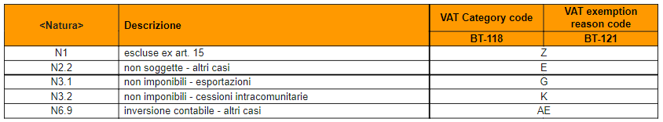
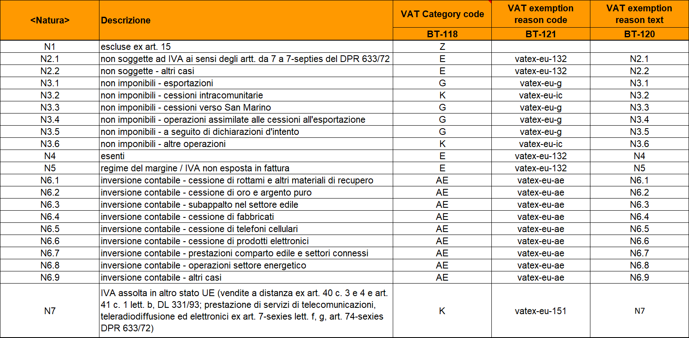

= Value added tax (VAT)

The chapters below describe the different VAT informations that can be provided in a {peppol} invoice or credit note.

Please also see <<VAT category codes>> for details on the VAT category code list, and <<Calculation of VAT>> for detailed explanation and example on how to perform the calculations for VAT Breakdown.

== Line VAT Information

=== Cross-border billing rules

Each line of the invoice must have the VAT category code referring to the invoiced item (BT-151 VAT category code cac: ClassifiedTaxCategory / cbc: ID).+
If the VAT category is Z or E or G or K or AE, the BT-152 Invoiced item VAT rate (cac:ClassifiedTaxCategory/cbc:Percent) should be set equal to 0.

=== Rules for domestic billing

#Each line of the invoice must have the VAT category code referring to the invoiced item (BT-151 VAT category code cac:ClassifiedTaxCategory/cbc: ID).#+
#If the VAT category is S or B, the VAT rate must be entered in BT-152 Invoiced item VAT rate (cac:ClassifiedTaxCategory/cbc:Percent).#

#For domestic invoices (BT-40 Seller country code equal to IT and BT-55 Buyer country code equal to IT) the management of the Nature of the line is carried out by using *cac:AdditionalItemProperty/cbc:Name* (BT-160) and *cac:AdditionalItemProperty/cbc:Value* (BT-161) to indicate nature at the invoice line level.# +
#The item attribute name is enhanced with the string "NATURA", the item attribute value with the nature code according to the FatturaPA specifications.#

[source, xml, indent=0]
----
<cac:InvoiceLine>
  <cbc:ID>1</cbc:ID>
  <cbc:InvoicedQuantity unitCode="C62">5</cbc:InvoicedQuantity>
  <cbc:LineExtensionAmount currencyID="EUR">100.00</cbc:LineExtensionAmount>
  <cac:Item>
    <cbc:Name>Importo degli imballaggi</cbc:Name>
    <cac:ClassifiedTaxCategory>
      <cbc:ID>Z</cbc:ID>
      <cbc:Percent>0</cbc:Percent>
      <cac:TaxScheme>
        <cbc:ID>VAT</cbc:ID>
      </cac:TaxScheme>
    </cac:ClassifiedTaxCategory>
    <cac:AdditionalItemProperty>
      <cbc:Name>NATURA</cbc:Name>
      <cbc:Value>N1</cbc:Value>
    </cac:AdditionalItemProperty>
  </cac:Item>
  <cac:Price>
    <cbc:PriceAmount currencyID="EUR">20.00</cbc:PriceAmount>
    <cbc:BaseQuantity unitCode="C62">1</cbc:BaseQuantity>
  </cac:Price>
</cac:InvoiceLine>
----

== Document level allowance or charge

Each document level charge or allowance must have the Document level allowance or charge VAT category code (BT-95 and BT-102), and for all VAT categories except "Not subject to VAT" (O), the VAT rate shall be provided.

[IMPORTANT]
#Per la fatturazione verso soggetti italiani la sezione è utilizzata solo per Bollo (vedi paragrafo 4.9) e Rivalsa Cassa Previdenziale (vedi paragrafo 4.8).#

#Per gli sconti e maggiorazioni a livello di testata che non incidono sull’imponibile vedasi 10.5. Sconti e maggiorazioni.#

== Nature of the transaction and VAT summaries

=== Cross-border billing rules

364 / 5.000
Risultati della traduzione
The management of the nature of the operation (FPA 2.2.2.2 Nature) for cross-border invoices (BT-40 Seller country code other than IT and BT-55 Buyer country code equal to IT)
is operated by using the *cac:TaxCategory/cbc:ID* (BT-118 VAT category code) for VAT summaries and *cac:Subtotal/cbc:TaxExemptionReasonCode* (BT-121 VAT VAT exemption reason code).

.Tabella di relazione tra natura, VAT Category Code e VAT exemption reason code

[IMPORTANT]
La fattura non può contenere più di un TaxSubtotal

=== Regole per la fatturazione domestica

#La gestione della natura dell'operazione (FPA 2.2.2.2 Natura) per le fatture domestiche (BT-40 Seller country code pari a IT e BT-55 Buyer country code pari a IT) è operata a mezzo dell’utilizzo di:# +

1.	#*cac:TaxCategory/cbc:ID* (BT-118 VAT category code) per i riepiloghi IVA e *cac:Item/cac:TaxCategory/cbc:ID* (BT-151 VAT category code) per le righe di fattura;#
2.	#*cbc:TaxExemptionReason* (BT-120 VAT exemption reason text) per i riepiloghi IVA, in cui viene inserita il codice natura secondo le specifiche FatturaPA ed il Riferimento Normativo;#
3.	#*cbc:TaxExemptionReasonCode* (BT-121 VAT exemption reason code) per i riepiloghi IVA, cosiddetta tabella VATEX;#

[NOTE]
Trattasi di CIUS domestica (DC)

.Tabella di relazione tra natura, VAT Category Code e VAT exemption reason code

One VAT Breakdown shall be provided for each distinct combination of VAT category code and VAT rate found in either the line VAT information or the Document level allowance or charges. For some VAT categories, the VAT rate shall be zero, and hence the rate is not needed in order to group the VAT Breakdown for these.

Please note that for the VAT rate, only significant decimals should be considered, i.e any difference in trailing zeros should not result in different VAT breakdowns.

[IMPORTANT]
#Non è possibile inserire nella medesima fattura operazioni con il medesimo Tax Category ID (BT-118 VAT category code) e natura differente.#

_Esempio:_
====
Riga 1 della fattura ha categoria IVA = S e aliquota IVA = *25,00* +
Riga 2 della fattura ha categoria IVA = S e aliquota IVA = *25,00* +
Questo dovrebbe originare un singolo riepilogo IVA.
====

Per altri dettagli vedi anche il paragrafo <<anchor-11,9.4. Calcolo dell’IVA>>.

==== #Caso 1 - natura diversa da N1 – esempio riferito ad un’operazione in regime di reverse charge#

[source, xml, indent=0]
----
<cac:TaxTotal>
  <cbc:TaxAmount currencyID="EUR">0.00</cbc:TaxAmount>
  <cac:TaxSubtotal>
    <cbc:TaxableAmount currencyID="EUR">100.00</cbc:TaxableAmount>
    <cbc:TaxAmount currencyID="EUR">0.00</cbc:TaxAmount>
    <cac:TaxCategory>
      <cbc:ID>AE</cbc:ID>
    </cac:TaxCategory>
    <cbc:TaxExemptionReasonCode>vatex-eu-ae</cbc:TaxExemptionReasonCode>
    <cbc:TaxExemptionReason>N6.3#Art.16,co.6,lett.a (prestazioni di servizi rese dai subappaltatori nel settore edilizio)</cbc:TaxExemptionReason>
    <cac:TaxScheme>
      <cbc:ID>VAT</cbc:ID>
    </cac:TaxScheme>
  </cac:TaxSubtotal>
</cac:TaxTotal>
<!-- ... -->
<cac:InvoiceLine>
  <cbc:ID>1</cbc:ID>
  <cbc:InvoicedQuantity unitCode="C62">1</cbc:InvoicedQuantity>
  <cbc:LineExtensionAmount currencyID="EUR">100.00</cbc:LineExtensionAmount>
  <cac:Item>
    <cbc:Description>Inversione contabile</cbc:Description>
    <cbc:Name>Subappalto nel settore edile</cbc:Name>
    <cac:ClassifiedTaxCategory>
      <cbc:ID>AE</cbc:ID>
      <cac:TaxScheme>
        <cbc:ID>VAT</cbc:ID>
      </cac:TaxScheme>
    </cac:ClassifiedTaxCategory>
    <cac:AdditionalItemProperty>
      <cbc:Name>NATURA</cbc:Name>
      <cbc:Value>N6.3</cbc:Value>
    </cac:AdditionalItemProperty>
  </cac:Item>
  <cac:Price>
    <cbc:PriceAmount currencyID="EUR">100.00</cbc:PriceAmount>
  </cac:Price>
----

==== #Caso 2 - natura N1 – esempio riferito ad un’operazione esclusa#

[source, xml, indent=0]
----
<cac:TaxTotal>
  <cbc:TaxAmount currencyID="EUR">0.00</cbc:TaxAmount>
  <cac:TaxSubtotal>
    <cbc:TaxableAmount currencyID="EUR">100.00</cbc:TaxableAmount>
    <cbc:TaxAmount currencyID="EUR">0.00</cbc:TaxAmount>
    <cac:TaxCategory>
      <cbc:ID>Z</cbc:ID>
      <cbc:Percent>0</cbc:Percent>
    </cac:TaxCategory>
    <cac:TaxScheme>
      <cbc:ID>VAT</cbc:ID>
    </cac:TaxScheme>
  </cac:TaxSubtotal>
</cac:TaxTotal>
<!-- ... -->
<cac:InvoiceLine>
  <cbc:ID>1</cbc:ID>
  <cbc:InvoicedQuantity unitCode="C62">5</cbc:InvoicedQuantity>
  <cbc:LineExtensionAmount currencyID="EUR">100.00</cbc:LineExtensionAmount>
  <cac:Item>
    <cbc:Name>Importo degli imballaggi</cbc:Name>
    <cac:ClassifiedTaxCategory>
      <cbc:ID>Z</cbc:ID>
      <cbc:Percent>0</cbc:Percent>
      <cac:TaxScheme>
        <cbc:ID>VAT</cbc:ID>
      </cac:TaxScheme>
    </cac:ClassifiedTaxCategory>
    <cac:AdditionalItemProperty>
      <cbc:Name>NATURA</cbc:Name>
      <cbc:Value>N1</cbc:Value>
    </cac:AdditionalItemProperty>
  </cac:Item>
  <cac:Price>
    <cbc:PriceAmount currencyID="EUR">20.00</cbc:PriceAmount>
    <cbc:BaseQuantity unitCode="C62">1</cbc:BaseQuantity>
  </cac:Price>
</cac:InvoiceLine>
----
== Invoice total VAT amount

The invoice total VAT amount (BT-110) is the sum of all VAT Category VAT amounts (BT-117)

== #Data operazione ed esigibilità IVA#

La gestione della data operazione e dell’esigibilità IVA è operata a mezzo dell’utilizzo di: +

1.	*cbc:IssueDate* (BT-2 Invoice issue date);
2.	*cac:InvoicePeriod/cbc:DescriptionCode* (BT-8 Value added tax point date code);
3.	*cbc:ActualDeliveryDate* (BT-72 Actual delivery date);
4.	*cac:TaxCategory/cbc:ID* (BT-118 VAT category code); +

Si evidenziano 6 casi distinti.

=== Caso 1 - Esigibilità immediata, data fattura coincide con data operazione +

In questo caso il *cbc:IssueDate* (BT-2 Invoice issue date) viene valorizzato con data fattura/data operazione e il *cac:InvoicePeriod/cbc:DescriptionCode* (BT-8 Value added tax point date code) viene valorizzato con “3” (ovvero Invoice document issue time).

[source, xml, indent=0]
----
<cbc:IssueDate>2020-02-07</cbc:IssueDate>
<cac:InvoicePeriod>
  <cbc:DescriptionCode>3</cbc:DescriptionCode>
</cac:InvoicePeriod>
<cac:TaxTotal>
  <cbc:TaxAmount currencyID="EUR">22.00</cbc:TaxAmount>
  <cac:TaxSubtotal>
    <cbc:TaxableAmount currencyID="EUR">100.00</cbc:TaxableAmount>
    <cbc:TaxAmount currencyID="EUR">22.00</cbc:TaxAmount>
    <cac:TaxCategory>
      <cbc:ID>S</cbc:ID>
      <cbc:Percent>22</cbc:Percent>
    </cac:TaxCategory>
    <cac:TaxScheme>
      <cbc:ID>VAT</cbc:ID>
    </cac:TaxScheme>
  </cac:TaxSubtotal>
</cac:TaxTotal>
----

=== Caso 2 - Esigibilità immediata, data fattura non coincidente con data operazione

In questo caso il *cbc:IssueDate* (BT-2 Invoice issue date) viene valorizzato con data fattura, il *cac:InvoicePeriod/cbc:DescriptionCode* (BT-8 Value added tax point date code) viene valorizzato con “35” (ovvero Delivery date, actual) ed il *cbc:ActualDeliveryDate* (BT-72 Actual delivery date) viene valorizzato con la data operazione.

[source, xml, indent=0]
----
<cbc:IssueDate>2020-01-20</cbc:IssueDate>
<!-- ... -->
<cac:InvoicePeriod>
  <cbc:DescriptionCode>35</cbc:DescriptionCode>
</cac:InvoicePeriod>
<!-- ... -->
<cac:Delivery>
  <cbc:ActualDeliveryDate>2020-01-15</cbc:ActualDeliveryDate>
</cac:Devlivery>
<!-- ... -->
<cac:TaxTotal>
  <cbc:TaxAmount currencyID="EUR">22.00</cbc:TaxAmount>
  <cac:TaxSubtotal>
    <cbc:TaxableAmount currencyID="EUR">100.00</cbc:TaxableAmount>
    <cbc:TaxAmount currencyID="EUR">22.00</cbc:TaxAmount>
    <cac:TaxCategory>
      <cbc:ID>S</cbc:ID>
      <cbc:Percent>22</cbc:Percent>
    </cac:TaxCategory>
    <cac:TaxScheme>
      <cbc:ID>VAT</cbc:ID>
    </cac:TaxScheme>
  </cac:TaxSubtotal>
</cac:TaxTotal>
----

=== Caso 3 - Esigibilità differita, data fattura coincide con data operazione

In questo caso il *cbc:IssueDate* (BT-2 Invoice issue date) viene valorizzato con data fattura/data operazione e il *cac:InvoicePeriod/cbc:DescriptionCode* (BT-8 Value added tax point date code) viene valorizzato con “432” (ovvero Paid to date).

[source, xml, indent=0]
----
<cbc:IssueDate>2020-02-07</cbc:IssueDate>
<!-- ... -->
<cac:InvoicePeriod>
  <cbc:DescriptionCode>432</cbc:DescriptionCode>
</cac:InvoicePeriod>
<!-- ... -->
<cac:TaxTotal>
  <cbc:TaxAmount currencyID="EUR">22.00</cbc:TaxAmount>
  <cac:TaxSubtotal>
    <cbc:TaxableAmount currencyID="EUR">100.00</cbc:TaxableAmount>
    <cbc:TaxAmount currencyID="EUR">22.00</cbc:TaxAmount>
    <cac:TaxCategory>
      <cbc:ID>S</cbc:ID>
      <cbc:Percent>22</cbc:Percent>
    </cac:TaxCategory>
    <cac:TaxScheme>
      <cbc:ID>VAT</cbc:ID>
    </cac:TaxScheme>
  </cac:TaxSubtotal>
</cac:TaxTotal>
----

=== Caso 4 - Esigibilità differita, data fattura non coincidente con data operazione

In questo caso il *cbc:IssueDate* (BT-2 Invoice issue date) viene valorizzato con data fattura, il *cac:InvoicePeriod/cbc:DescriptionCode* (BT-8 Value added tax point date code) viene valorizzato con “432” (ovvero Paid to date) ed il *cbc:ActualDeliveryDate* (BT-72 Actual delivery date) viene valorizzato con la data operazione.

[source, xml, indent=0]
----
<cbc:IssueDate>2020-01-20</cbc:IssueDate>
<!-- ... -->
<cac:InvoicePeriod>
  <cbc:DescriptionCode>432</cbc:DescriptionCode>
</cac:InvoicePeriod>
<!-- ... -->
<cac:Delivery>
  <cbc:ActualDeliveryDate>2020-01-15</cbc:ActualDeliveryDate>
</cac:Devlivery>
<!-- ... -->
<cac:TaxTotal>
  <cbc:TaxAmount currencyID="EUR">22.00</cbc:TaxAmount>
  <cac:TaxSubtotal>
    <cbc:TaxableAmount currencyID="EUR">100.00</cbc:TaxableAmount>
    <cbc:TaxAmount currencyID="EUR">22.00</cbc:TaxAmount>
    <cac:TaxCategory>
      <cbc:ID>S</cbc:ID>
      <cbc:Percent>22</cbc:Percent>
    </cac:TaxCategory>
    <cac:TaxScheme>
      <cbc:ID>VAT</cbc:ID>
    </cac:TaxScheme>
  </cac:TaxSubtotal>
</cac:TaxTotal>
----

=== Caso 5 – Split payment, data fattura coincide con data operazione

In questo caso il *cbc:IssueDate* (BT-2 Invoice issue date) viene valorizzato con data fattura/data operazione, il *cac:InvoicePeriod/cbc:DescriptionCode* (BT-8 Value added tax point date code) è lasciato vuoto e il *cac:TaxCategory/cbc:ID* (BT-118 VAT category code) viene valorizzato con “B” (ovvero split payment).

[source, xml, indent=0]
----
<cbc:IssueDate>2020-02-07</cbc:IssueDate>
<!-- ... -->
<cac:TaxTotal>
  <cbc:TaxAmount currencyID="EUR">22.00</cbc:TaxAmount>
  <cac:TaxSubtotal>
    <cbc:TaxableAmount currencyID="EUR">100.00</cbc:TaxableAmount>
    <cbc:TaxAmount currencyID="EUR">22.00</cbc:TaxAmount>
    <cac:TaxCategory>
      <cbc:ID>B</cbc:ID>
      <cbc:Percent>22</cbc:Percent>
    </cac:TaxCategory>
    <cac:TaxScheme>
      <cbc:ID>VAT</cbc:ID>
    </cac:TaxScheme>
  </cac:TaxSubtotal>
</cac:TaxTotal>
----

=== Caso 6 – Split payment, data fattura non coincidente con data operazione

In questo caso il *cbc:IssueDate* (BT-2 Invoice issue date) viene valorizzato con la data fattura, il *cac:InvoicePeriod/cbc:DescriptionCode* (BT-8 Value added tax point date code) è lasciato vuoto, il *cbc:ActualDeliveryDate* (BT-72 Actual delivery date) viene valorizzato con la data operazione ed il *cac:TaxCategory/cbc:ID* (BT-118 VAT category code) viene valorizzato con “B” (ovvero split payment).

[source, xml, indent=0]
----
<cbc:IssueDate>2020-01-20</cbc:IssueDate>
<!-- ... -->
<cac:Delivery>
  <cbc:ActualDeliveryDate>2020-01-15</cbc:ActualDeliveryDate>
</cac:Devlivery>
<!-- ... -->
<cac:TaxTotal>
  <cbc:TaxAmount currencyID="EUR">22.00</cbc:TaxAmount>
  <cac:TaxSubtotal>
    <cbc:TaxableAmount currencyID="EUR">100.00</cbc:TaxableAmount>
    <cbc:TaxAmount currencyID="EUR">22.00</cbc:TaxAmount>
    <cac:TaxCategory>
      <cbc:ID>B</cbc:ID>
      <cbc:Percent>22</cbc:Percent>
    </cac:TaxCategory>
    <cac:TaxScheme>
      <cbc:ID>VAT</cbc:ID>
    </cac:TaxScheme>
  </cac:TaxSubtotal>
</cac:TaxTotal>
----
