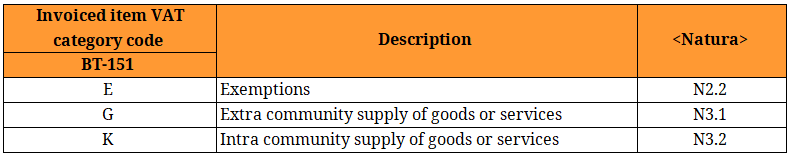
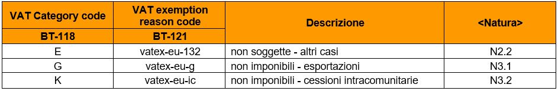
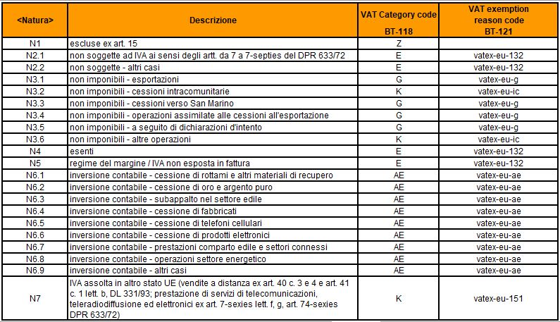

= Imposta sul valore aggiunto (IVA)

I capitoli seguenti descrivono le diverse informazioni in materia dell'IVA che possono essere fornite in una fattura o in una nota di credito.

Si consiglia di consultare anche i <<anchor-17, VAT category codes>> per dettagli sulla codifica delle categorie IVA e il <<anchor-42, Calcolo dell'IVA>> per una rappresentazione più dettagliata ed esempi su come eseguire i calcoli nel riepilogo IVA.

== Informazioni IVA su riga

=== #Rules for invoices coming from abroad (cross-border)#

For each invoice line, the VAT category code must be entered in *cac:ClassifiedTaxCategory/cbc:ID* (BT-151 Invoiced item VAT category code). +
For VAT categories E, G and K the *cac:ClassifiedTaxCategory/cbc:Percent* (BT-152 Invoiced item VAT rate) must be set equal to 0.

.Joining table between Invoiced item VAT Category Code and Natura FPA 

=== #Rules for domestic invoicing#

For each invoice line, the VAT category code must be entered in *cac:ClassifiedTaxCategory/cbc:ID* (BT-151 Invoiced item VAT category code). 

For VAT categories Z, E, G, K, and AE, the *cac:ClassifiedTaxCategory/cbc:Percent* (BT-152 Invoiced item VAT rate) must be set to 0. 

For VAT categories S and B, the applicable VAT rate must be entered in *cac:ClassifiedTaxCategory/cbc:Percent* (BT-152 Invoiced item VAT rate). 

The management of the nature of the invoice line is carried out by using the elements *cac:AdditionalItemProperty/cbc:Name* (BT-160) and *cac:AdditionalItemProperty/cbc:Value* (BT-161), setting cbc:Name to the string "NATURA" and cbc:Value to the corresponding Natura FPA code according to the FatturaPA specifications. 

[source, xml, indent=0]
----
<cac:InvoiceLine>
	<cbc:ID>1</cbc:ID>
	<cbc:InvoicedQuantity unitCode="C62">5</cbc:InvoicedQuantity>
	<cbc:LineExtensionAmount currencyID="EUR">100.00</cbc:LineExtensionAmount>
	<cac:Item>
		<cbc:Name>Importo degli imballaggi</cbc:Name>
		<cac:ClassifiedTaxCategory>
			<cbc:ID>Z</cbc:ID>
			<cbc:Percent>0</cbc:Percent>
			<cac:TaxScheme>
				<cbc:ID>VAT</cbc:ID>
			</cac:TaxScheme>
		</cac:ClassifiedTaxCategory>
		<cac:AdditionalItemProperty>
			<cbc:Name>NATURA</cbc:Name>
			<cbc:Value>N1</cbc:Value>
		</cac:AdditionalItemProperty>
	</cac:Item>
	<cac:Price>
		<cbc:PriceAmount currencyID="EUR">20.00</cbc:PriceAmount>
		<cbc:BaseQuantity unitCode="C62">1</cbc:BaseQuantity>
		<cac:AllowanceCharge>
			<cbc:ChargeIndicator>false</cbc:ChargeIndicator>
			<cbc:Amount currencyID="EUR">0.00</cbc:Amount>
			<cbc:BaseAmount currencyID="EUR">20.00</cbc:BaseAmount>
		</cac:AllowanceCharge>
	</cac:Price>
</cac:InvoiceLine>
----

=== #Guidelines for invoicing to abroad#

For invoicing to foreign countries, please check with the purchaser for the possible presence of CIUS. +
For further information, please consult the following https://ec.europa.eu/digital-building-blocks/wikis/display/DIGITAL/CIUS+and+Extension+-+What+is+allowed[link].

=== #Guidelines for esterometro and integration documents#

The management of nature is carried out similarly to what is provided for domestic invoicing (see paragraph 8.1.2).

== Document level allowance or charge

Each document level charge or allowance must have the Document level allowance or charge VAT category code (BT-95 and BT-102), and for all VAT categories except "Not subject to VAT" (O), the VAT rate shall be provided. +

[IMPORTANT]
#A cross-border invoice shall not contain charge or allowance at the header level.#
#This section is used only for domestic billing for Social Security Contribution (see paragraph 5.8) and Stamp Duty (see paragraph 5.9). For allowance and charges at the document level that do not affect the taxable amount, see section 11.5 Allowance and Charges.#

== VAT Breakdown

Deve essere fornito un solo riepilogo IVA per ogni combinazione distinta di categoria e aliquota IVA sia a livello di riga che negli sconti e maggiorazioni a livello di testata. Per alcune categorie IVA, l’aliquota deve essere posta a zero e quindi non viene utilizzata in questi casi per raggruppare il riepilogo IVA. +
Please note that for the VAT rate, only significant decimals should be considered, i.e any difference in trailing zeros should not result in different VAT breakdowns.

[IMPORTANT]
#It is not allowed to include transactions with the same Tax Category ID (BT-118 VAT category code) but different nature within the same invoice.#

_Esempio:_
====
Riga 1 della fattura ha categoria IVA = S e aliquota IVA = *25,00* +
Riga 2 della fattura ha categoria IVA = S e aliquota IVA = *25,00* +
Questo dovrebbe originare un singolo riepilogo IVA.
====

Per altri dettagli vedi anche il paragrafo 10.4. Calcolo dell’IVA.

=== #Rules for billing from abroad (cross-border)#

The management of the nature of the transaction (FPA 2.2.2.2 Natura) for invoices from abroad is carried out through the usage of:

1. *cac:TaxCategory/cbc:ID* (BT-118 VAT category code);
2. *cbc:TaxExemptionReasonCode* (BT-121 VAT exemption reason code);

.Figure 2. Joining table between VAT Category Code, VAT exemption reason code e FPA Natura

[IMPORTANT]
It is not allowed to include more than one TaxSubtotal for the same VAT category within the same invoice.

=== #Rules for domestic billing#

The management of the nature of the transaction (FPA 2.2.2.2 Natura) for domestic invoices is carried out through the usage of: +

1. *cac:TaxCategory/cbc:ID* (BT-118 VAT category code);
2. *cbc:TaxExemptionReasonCode* (BT-121 VAT exemption reason code);
3. *cbc:TaxExemptionReason* (BT-120 VAT exemption reason text), where the Natura according to the FatturaPA specifications and the Legal Reference are inserted, concatenated using the symbol #.

[NOTE]
This pertains to domestic CIUS (DC).

.Joining table between FPA Natura, VAT Category Code and VAT exemption reason code

#Deve essere fornito un solo riepilogo IVA per ogni combinazione distinta di categoria e aliquota IVA sia a livello di riga che negli sconti e maggiorazioni a livello di testata. Per alcune categorie IVA, l’aliquota deve essere posta a zero e quindi non viene utilizzata in questi casi per raggruppare il riepilogo IVA.# +
#Per l’aliquota dell’IVA devono essere considerati solo i decimali significativi, ovvero qualsiasi differenza nei decimali non deve determinare differenti riepiloghi IVA.#

[IMPORTANT]
#Non è possibile inserire nella medesima fattura operazioni con il medesimo Tax Category ID (BT-118 VAT category code) e natura differente.#

_Esempio:_
====
Riga 1 della fattura ha categoria IVA = S e aliquota IVA = *25,00* +
Riga 2 della fattura ha categoria IVA = S e aliquota IVA = *25,00* +
Questo dovrebbe originare un singolo riepilogo IVA.
====

Per altri dettagli vedi anche il paragrafo 10.4. Calcolo dell’IVA.

==== Case 1 – Natura different from N1 - Example of a reverse charge transaction 

[source, xml, indent=0]
----
<cac:TaxTotal>
  <cbc:TaxAmount currencyID="EUR">0.00</cbc:TaxAmount>
  <cac:TaxSubtotal>
    <cbc:TaxableAmount currencyID="EUR">100.00</cbc:TaxableAmount>
    <cbc:TaxAmount currencyID="EUR">0.00</cbc:TaxAmount>
    <cac:TaxCategory>
      <cbc:ID>AE</cbc:ID>
    </cac:TaxCategory>
    <cbc:TaxExemptionReasonCode>vatex-eu-ae</cbc:TaxExemptionReasonCode>
    <cbc:TaxExemptionReason>N6.3#Art.16,co.6,lett.a (prestazioni di servizi rese dai subappaltatori nel settore edilizio)</cbc:TaxExemptionReason>
    <cac:TaxScheme>
      <cbc:ID>VAT</cbc:ID>
    </cac:TaxScheme>
  </cac:TaxSubtotal>
</cac:TaxTotal>
<!-- ... -->
<cac:InvoiceLine>
	<cbc:ID>1</cbc:ID>
	<cbc:InvoicedQuantity unitCode="C62">1</cbc:InvoicedQuantity>
	<cbc:LineExtensionAmount currencyID="EUR">100.00</cbc:LineExtensionAmount>
	<cac:Item>
		<cbc:Description>Inversione contabile</cbc:Description>
		<cbc:Name>Subappalto nel settore edile</cbc:Name>
		<cac:ClassifiedTaxCategory>
			<cbc:ID>AE</cbc:ID>
			<cac:TaxScheme>
				<cbc:ID>VAT</cbc:ID>
			</cac:TaxScheme>
		</cac:ClassifiedTaxCategory>
		<cac:AdditionalItemProperty>
			<cbc:Name>NATURA</cbc:Name>
			<cbc:Value>N6.3</cbc:Value>
		</cac:AdditionalItemProperty>
	</cac:Item>
	<cac:Price>
		<cbc:PriceAmount currencyID="EUR">100.00</cbc:PriceAmount>
		<cac:AllowanceCharge>
			<cbc:ChargeIndicator>false</cbc:ChargeIndicator>
			<cbc:Amount currencyID="EUR">0.00</cbc:Amount>
			<cbc:BaseAmount currencyID="EUR">100.00</cbc:BaseAmount>
		</cac:AllowanceCharge>
	</cac:Price>
</cac:InvoiceLine>
----

==== Case 2 – Natura equal to N1 - Example of an excluded transaction

[source, xml, indent=0]
----
<cac:TaxTotal>
  <cbc:TaxAmount currencyID="EUR">0.00</cbc:TaxAmount>
  <cac:TaxSubtotal>
    <cbc:TaxableAmount currencyID="EUR">100.00</cbc:TaxableAmount>
    <cbc:TaxAmount currencyID="EUR">0.00</cbc:TaxAmount>
    <cac:TaxCategory>
      <cbc:ID>Z</cbc:ID>
      <cbc:Percent>0</cbc:Percent>
    </cac:TaxCategory>
    <cac:TaxScheme>
      <cbc:ID>VAT</cbc:ID>
    </cac:TaxScheme>
  </cac:TaxSubtotal>
</cac:TaxTotal>
<!-- ... -->
<cac:InvoiceLine>
	<cbc:ID>1</cbc:ID>
	<cbc:InvoicedQuantity unitCode="C62">5</cbc:InvoicedQuantity>
	<cbc:LineExtensionAmount currencyID="EUR">100.00</cbc:LineExtensionAmount>
	<cac:Item>
		<cbc:Name>Importo degli imballaggi</cbc:Name>
		<cac:ClassifiedTaxCategory>
			<cbc:ID>Z</cbc:ID>
			<cbc:Percent>0</cbc:Percent>
			<cac:TaxScheme>
				<cbc:ID>VAT</cbc:ID>
			</cac:TaxScheme>
		</cac:ClassifiedTaxCategory>
		<cac:AdditionalItemProperty>
			<cbc:Name>NATURA</cbc:Name>
			<cbc:Value>N1</cbc:Value>
		</cac:AdditionalItemProperty>
	</cac:Item>
	<cac:Price>
		<cbc:PriceAmount currencyID="EUR">20.00</cbc:PriceAmount>
		<cbc:BaseQuantity unitCode="C62">1</cbc:BaseQuantity>
		<cac:AllowanceCharge>
			<cbc:ChargeIndicator>false</cbc:ChargeIndicator>
			<cbc:Amount currencyID="EUR">0.00</cbc:Amount>
			<cbc:BaseAmount currencyID="EUR">20.00</cbc:BaseAmount>
		</cac:AllowanceCharge>
	</cac:Price>
</cac:InvoiceLine>
----

=== #Guidelines for invoicing to abroad#

For invoicing to foreign countries, please check with the purchaser for the possible presence of CIUS. +
For further information, please consult the following https://ec.europa.eu/digital-building-blocks/wikis/display/DIGITAL/CIUS+and+Extension+-+What+is+allowed[link].

=== #Guidelines for esterometro and integration documents#

The management of the nature is carried out similarly to what is provided for domestic billing (see paragraph 8.3.2).

== Totale IVA

Il totale IVA *cbc:TaxAmount* (BT-110) è la somma delle imposte dei singoli riepiloghi *cbc:TaxAmount* (BT-117)

== #Transaction date and VAT liability#

The management of the transaction date and VAT liability is handled through the use of: +

1.	*cbc:IssueDate* (BT-2 Invoice issue date);
2.	*cac:InvoicePeriod/cbc:DescriptionCode* (BT-8 Value added tax point date code);
3.	*cbc:ActualDeliveryDate* (BT-72 Actual delivery date);
4.	*cac:TaxCategory/cbc:ID* (BT-118 VAT category code); +

Six distinct cases are highlighted.

=== Case 1 - Immediate VAT liability, invoice date coincides with transaction date +

In this case, *cbc:IssueDate* (BT-2 Invoice issue date) is populated with the invoice date/transaction date and *cac:InvoicePeriod/cbc:DescriptionCode* (BT-8 Value added tax point date code) is set to "3" (i.e., Invoice document issue time).

[source, xml, indent=0]
----
<cbc:IssueDate>2020-02-07</cbc:IssueDate>
<!-- ... -->
<cac:InvoicePeriod>
  <cbc:DescriptionCode>3</cbc:DescriptionCode>
</cac:InvoicePeriod>
<!-- ... -->
<cac:TaxTotal>
  <cbc:TaxAmount currencyID="EUR">22.00</cbc:TaxAmount>
  <cac:TaxSubtotal>
    <cbc:TaxableAmount currencyID="EUR">100.00</cbc:TaxableAmount>
    <cbc:TaxAmount currencyID="EUR">22.00</cbc:TaxAmount>
    <cac:TaxCategory>
      <cbc:ID>S</cbc:ID>
      <cbc:Percent>22</cbc:Percent>
    </cac:TaxCategory>
    <cac:TaxScheme>
      <cbc:ID>VAT</cbc:ID>
    </cac:TaxScheme>
  </cac:TaxSubtotal>
</cac:TaxTotal>
----

=== Case 2 – Immediate VAT liability, invoice date does not coincide with transaction date

In this case, *cbc:IssueDate* (BT-2 Invoice issue date) is populated with the invoice date, *cac:InvoicePeriod/cbc:DescriptionCode* (BT-8 Value added tax point date code) is set to “35” (i.e., Delivery date, actual), and *cbc:ActualDeliveryDate* (BT-72 Actual delivery date) is populated with the transaction date.

[source, xml, indent=0]
----
<cbc:IssueDate>2020-01-20</cbc:IssueDate>
<!-- ... -->
<cac:InvoicePeriod>
  <cbc:DescriptionCode>35</cbc:DescriptionCode>
</cac:InvoicePeriod>
<!-- ... -->
<cac:Delivery>
  <cbc:ActualDeliveryDate>2020-01-15</cbc:ActualDeliveryDate>
</cac:Devlivery>
<!-- ... -->
<cac:TaxTotal>
  <cbc:TaxAmount currencyID="EUR">22.00</cbc:TaxAmount>
  <cac:TaxSubtotal>
    <cbc:TaxableAmount currencyID="EUR">100.00</cbc:TaxableAmount>
    <cbc:TaxAmount currencyID="EUR">22.00</cbc:TaxAmount>
    <cac:TaxCategory>
      <cbc:ID>S</cbc:ID>
      <cbc:Percent>22</cbc:Percent>
    </cac:TaxCategory>
    <cac:TaxScheme>
      <cbc:ID>VAT</cbc:ID>
    </cac:TaxScheme>
  </cac:TaxSubtotal>
</cac:TaxTotal>
----

=== Case 3 – Deferred VAT liability, invoice date coincides with transaction date

In this case, *cbc:IssueDate* (BT-2 Invoice issue date) is populated with the invoice date/transaction date and *cac:InvoicePeriod/cbc:DescriptionCode* (BT-8 Value added tax point date code) is set to “432” (i.e., Paid to date).

[source, xml, indent=0]
----
<cbc:IssueDate>2020-02-07</cbc:IssueDate> 
<!-- ... --> 
<cac:InvoicePeriod> 
  <cbc:DescriptionCode>3</cbc:DescriptionCode> 
</cac:InvoicePeriod> 
<!-- ... --> 
<cac:TaxTotal> 
  <cbc:TaxAmount currencyID="EUR">22.00</cbc:TaxAmount> 
  <cac:TaxSubtotal> 
    <cbc:TaxableAmount currencyID="EUR">100.00</cbc:TaxableAmount> 
    <cbc:TaxAmount currencyID="EUR">22.00</cbc:TaxAmount> 
    <cac:TaxCategory> 
      <cbc:ID>S</cbc:ID> 
      <cbc:Percent>22</cbc:Percent> 
    </cac:TaxCategory> 
    <cac:TaxScheme> 
      <cbc:ID>VAT</cbc:ID> 
    </cac:TaxScheme> 
  </cac:TaxSubtotal> 
</cac:TaxTotal>
----

=== Case 4 – Deferred VAT liability, invoice date does not coincide with transaction date 

In this case, *cbc:IssueDate* (BT-2 Invoice issue date) is populated with the invoice date, *cac:InvoicePeriod/cbc:DescriptionCode* (BT-8 Value added tax point date code) is set to “432” (i.e., Paid to date), and *cbc:ActualDeliveryDate* (BT-72 Actual delivery date) is populated with the transaction date.

[source, xml, indent=0]
----
<cbc:IssueDate>2020-01-20</cbc:IssueDate>
<!-- ... -->
<cac:InvoicePeriod>
  <cbc:DescriptionCode>432</cbc:DescriptionCode>
</cac:InvoicePeriod>
<!-- ... -->
<cac:Delivery>
  <cbc:ActualDeliveryDate>2020-01-15</cbc:ActualDeliveryDate>
</cac:Devlivery>
<!-- ... -->
<cac:TaxTotal>
  <cbc:TaxAmount currencyID="EUR">22.00</cbc:TaxAmount>
  <cac:TaxSubtotal>
    <cbc:TaxableAmount currencyID="EUR">100.00</cbc:TaxableAmount>
    <cbc:TaxAmount currencyID="EUR">22.00</cbc:TaxAmount>
    <cac:TaxCategory>
      <cbc:ID>S</cbc:ID>
      <cbc:Percent>22</cbc:Percent>
    </cac:TaxCategory>
    <cac:TaxScheme>
      <cbc:ID>VAT</cbc:ID>
    </cac:TaxScheme>
  </cac:TaxSubtotal>
</cac:TaxTotal>
----

=== Case 5 – Split payment, invoice date coincides with transaction date

In this case, *cbc:IssueDate* (BT-2 Invoice issue date) is populated with the invoice date/transaction date, *cac:InvoicePeriod/cbc:DescriptionCode* (BT-8 Value added tax point date code) is left empty, and *cac:TaxCategory/cbc:ID* (BT-118 VAT category code) is set to “B” (i.e., split payment). 

[source, xml, indent=0]
----
<cbc:IssueDate>2020-02-07</cbc:IssueDate>
<!-- ... -->
<cac:TaxTotal>
  <cbc:TaxAmount currencyID="EUR">22.00</cbc:TaxAmount>
  <cac:TaxSubtotal>
    <cbc:TaxableAmount currencyID="EUR">100.00</cbc:TaxableAmount>
    <cbc:TaxAmount currencyID="EUR">22.00</cbc:TaxAmount>
    <cac:TaxCategory>
      <cbc:ID>B</cbc:ID>
      <cbc:Percent>22</cbc:Percent>
    </cac:TaxCategory>
    <cac:TaxScheme>
      <cbc:ID>VAT</cbc:ID>
    </cac:TaxScheme>
  </cac:TaxSubtotal>
</cac:TaxTotal>
----

=== Case 6 – Split payment, invoice date does not coincide with transaction date

In this case, *cbc:IssueDate* (BT-2 Invoice issue date) is populated with the invoice date, *cac:InvoicePeriod/cbc:DescriptionCode* (BT-8 Value added tax point date code) is left empty, *cbc:ActualDeliveryDate* (BT-72 Actual delivery date) is populated with the transaction date, and *cac:TaxCategory/cbc:ID* (BT-118 VAT category code) is set to “B” (i.e., split payment).

[source, xml, indent=0]
----
<cbc:IssueDate>2020-01-20</cbc:IssueDate>
<!-- ... -->
<cac:Delivery>
  <cbc:ActualDeliveryDate>2020-01-15</cbc:ActualDeliveryDate>
</cac:Devlivery>
<!-- ... -->
<cac:TaxTotal>
  <cbc:TaxAmount currencyID="EUR">22.00</cbc:TaxAmount>
  <cac:TaxSubtotal>
    <cbc:TaxableAmount currencyID="EUR">100.00</cbc:TaxableAmount>
    <cbc:TaxAmount currencyID="EUR">22.00</cbc:TaxAmount>
    <cac:TaxCategory>
      <cbc:ID>B</cbc:ID>
      <cbc:Percent>22</cbc:Percent>
    </cac:TaxCategory>
    <cac:TaxScheme>
      <cbc:ID>VAT</cbc:ID>
    </cac:TaxScheme>
  </cac:TaxSubtotal>
</cac:TaxTotal>
----