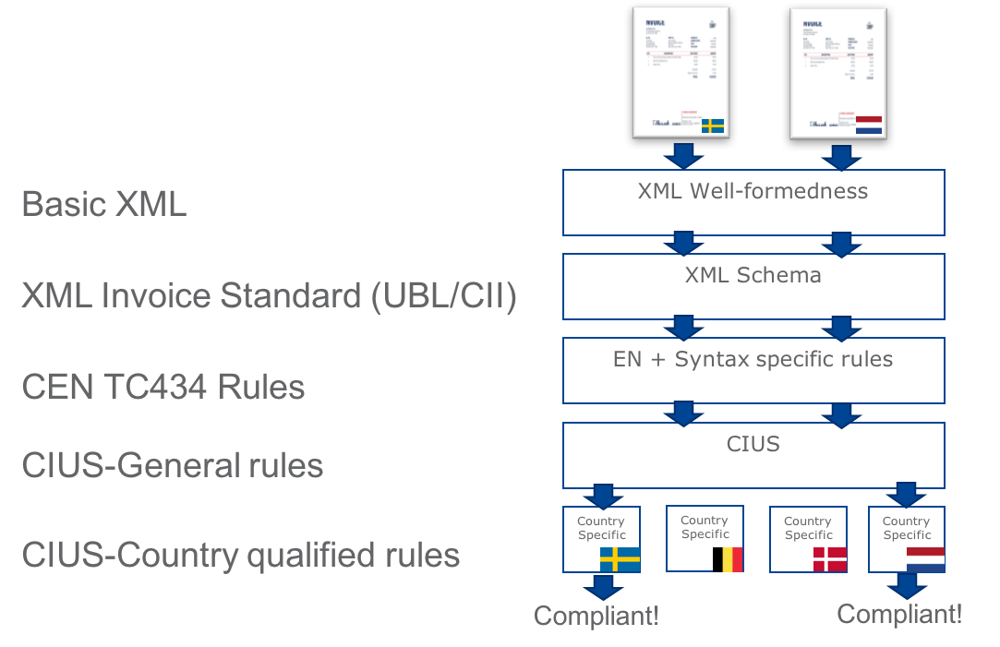

= Validazione

Per rendere flessibile il processo di validazione, ogni documento PEPPOL viene validato in diverse fasi spostando l'attenzione su ciascuna di esse. +

Il diagramma seguente illustra le diverse fasi:

:leveloffset: +1

include::_validation-principles.adoc[]

:leveloffset: -1
